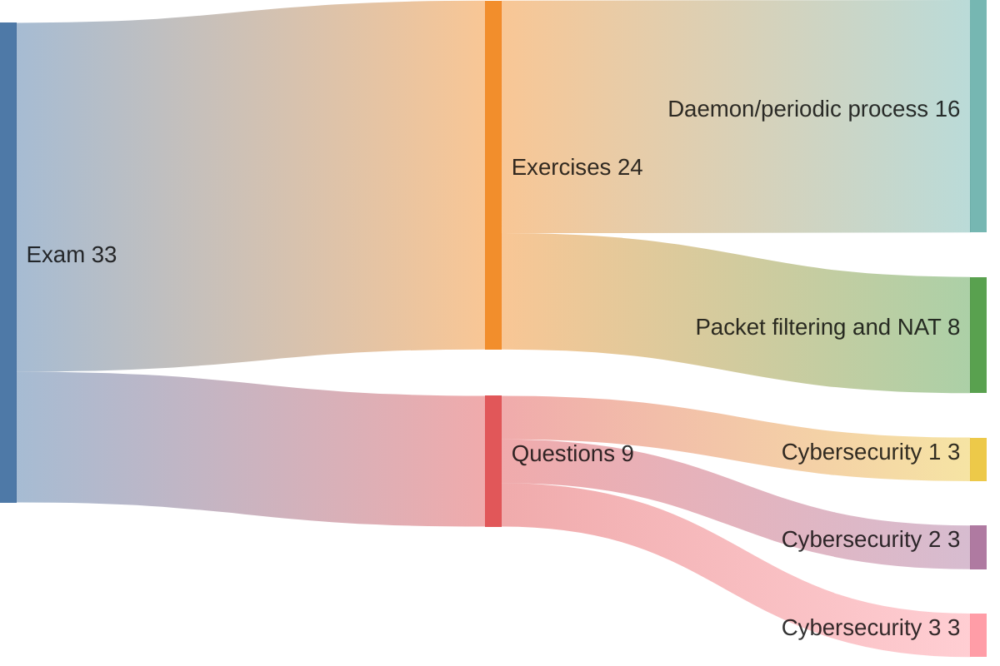
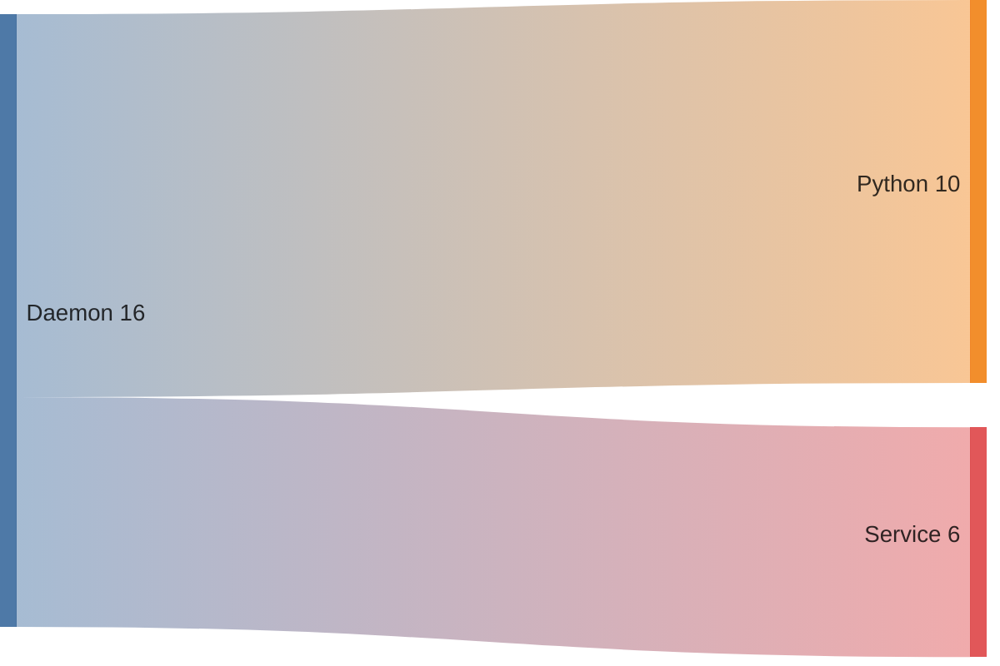
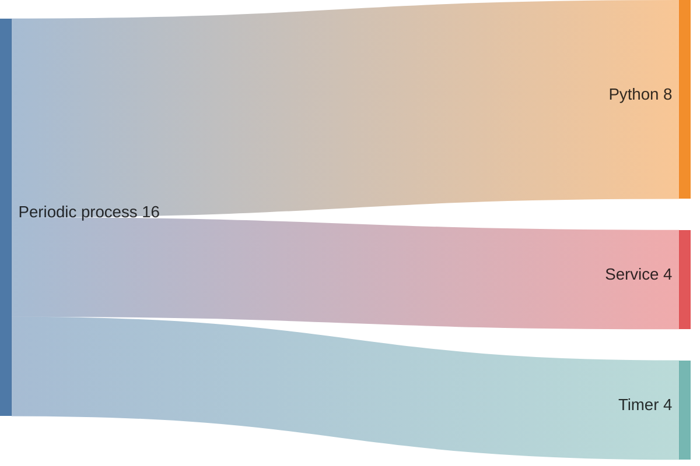
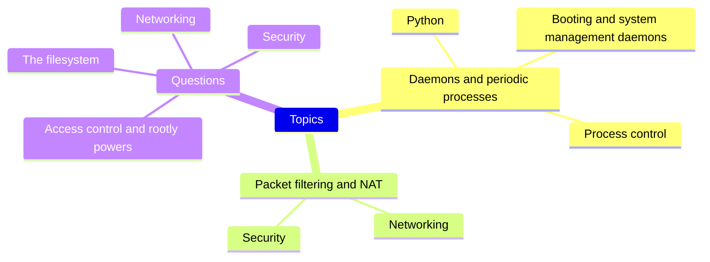

# Mock exam

## Table of contents

- [1. General instructions](#1-general-instructions)
- [2. Exercises](#2-exercises)
    - [2.1. File cleaner](#21-file-cleaner)
        - [2.1.1. Text](#211-text)
            - [2.1.1.1. Python](#2111-python)
            - [2.1.1.2. Service](#2112-service)
            - [2.1.1.3. Timer](#2113-timer)
        - [2.1.2. Hints](#212-hints)
        - [2.1.3. Solution](#213-solution)
    - [2.2. Firewall configuration](#22-firewall-configuration)
        - [2.2.1. Text](#221-text)
        - [2.2.2. Solution](#222-solution)
- [3. Questions](#3-questions)

## 1. General instructions

The exam consists of two exercises and three open questions. The first exercise requires you to write a Python script and either run it as a daemon or as a periodic process through `systemd`. The second exercise requires you to configure a firewall with `iptables`. The questions are related to security. The time available is 2.5 hours

The exam text is in Italian unless otherwise requested. If you wish the text in English, please let me know a few days in advance. Feel free to solve the exercises or answer the questions in either Italian or English

The only things you are allowed to look up during the exam are a printed version of the [cheat sheet](14-cheat-sheet.md) (in English or Italian), manual pages (`man`), and Python documentation (`help`)

---



---



---



---



---

| Topic                    | Text                                                                   | Solution                                  |
| ------------------------ | ---------------------------------------------------------------------- | ----------------------------------------- |
| Daemon                   | [CPU logger](7-booting-and-system-management-daemons-lab.md#2-cpu-logger) | [Project directory](../code/cpu-logger)   |
| Periodic process         | [File cleaner](#21-file-cleaner)                                       | [Project directory](../code/file-cleaner) |
| Packet filtering and NAT | [Firewall configuration](#22-firewall-configuration)                   | [Code snippet](#222-solution)             |
| Cybersecurity            | [Questions](#3-questions)                                              | n/a                                       |

## 2. Exercises

### 2.1. File Cleaner

#### 2.1.1. Text

##### 2.1.1.1. Python

Write a Python script that deletes every file with a given extension from a specified directory and all its subdirectories. In your home directory, create a directory named `file-cleaner` and inside it a file called `app.py`, using this template:

```python
# first and last name:
# serial number:
#
# path: 

import argparse
import os
import sys

def main():
    pass


if __name__ == "__main__":
    main()
```

The script must accept exactly two command-line arguments, parsed with the `argparse` module. The first argument, `--path`, is a required string giving the absolute path of the directory to clean. The second argument, `--extension`, is a required string giving the file extension to remove, which must begin with a dot (for example, `.tmp`). 

After parsing, validate both inputs: check that the path is absolute (`os.path.isabs`), exists (`os.path.exists`), and is a directory (`os.path.isdir`), and verify that the extension string starts with a dot (`str.startswith`). If a check fails, print an informative error message to standard error (`print`) and exit with a non-zero status code (`sys.exit`).

After validation, traverse the directory tree rooted at the given path (`os.listdir`, `os.path.join`, and `os.isdir`). For each file encountered (`os.isfile`), test whether its name ends with the specified extension ( `str.endswith`). If it does, delete the file (`os.remove`) and print a message (`print`). Do not attempt to delete any directories. Make sure your code handles nested subdirectories correctly and continues processing even if it encounters files it cannot delete.

For example, running

```shell
$ python ~/file-cleaner/app.py \
    --path ~/target \
    --extension .tmp
```

should delete every file whose name ends in `.tmp` from the directory `~/target` and all its subdirectories.

##### 2.1.1.2. Service

Create a service unit named `file-cleaner.service` in your `systemd` user instance. Configure it to launch `~/file-cleaner/app.py` with the arguments `--path %h/myapp` and `--extension .tmp`. Use this template for the unit file:

```shell
# first and last name:
# serial number:
#
# path: 
```

##### 2.1.1.3. Timer

Create a timer unit named `file-cleaner.timer` in your `systemd` user instance. Configure it to trigger `file-cleaner.service` every ten minutes on weekdays (Monday through Friday). Use this template for `file-cleaner.timer`:

```shell
# first and last name:
# serial number:
#
# path: 
# 
# command to enable the timer:
# command to start the timer:
```

#### 2.1.2. Hints

1. Set up a test directory called `~/myapp` with nested subfolders and a mix of file types (for example, `.log` and `.tmp`) so you can verify that your script removes only the `.tmp` files at every level

```shell
myapp/
├── 1.log
├── deleteme.tmp
└── dir
    ├── 2.log
    ├── deleteme.tmp
    └── subdir
        ├── 3.log
        └── deleteme.tmp
```

 2. Run your script with the exact arguments you’ll use in the service and confirm that it deletes every `.tmp` file in `~/myapp` and all nested subdirectories

```shell
$ cd file-cleaner
$ python app.py --path $HOME/myapp --extension .tmp 
removing /home/ubuntu/myapp/deleteme.tmp
removing /home/ubuntu/myapp/dir/deleteme.tmp
removing /home/ubuntu/myapp/dir/subdir/deleteme.tmp
```

3. Copy `file-cleaner.service` into your user-level units directory (`~/.config/systemd/user`), verify that `systemd` has loaded the unit, start the service, and inspect its journal to ensure it behaves correctly

```shell
$ cp file-cleaner.service ~/.config/systemd/user
$ systemctl --user list-unit-files file-cleaner.service
UNIT FILE            STATE  PRESET
file-cleaner.service static -

1 unit files listed.
$ systemctl --user start file-cleaner.service
$ journalctl --user -u file-cleaner.service
[...] Started file-cleaner.service - File Cleaner Service.
[...] removing /home/ubuntu/myapp/deleteme.tmp
[...] removing /home/ubuntu/myapp/dir/deleteme.tmp
[...] removing /home/ubuntu/myapp/dir/subdir/deleteme.tmp
```

4. Confirm that your timer’s calendar expression fires every ten minutes on weekdays

```shell
$ systemd-analyze calendar 'Mon..Fri *-*-* *:00/10' --iteration 3
Original form: Mon..Fri *-*-* *:00/10
Normalized form: Mon..Fri *-*-* *:00/10:00
    Next elapse: Mon 2025-05-19 06:30:00 UTC
       From now: 7min left
   Iteration #2: Mon 2025-05-19 06:40:00 UTC
       From now: 17min left
   Iteration #3: Mon 2025-05-19 06:50:00 UTC
       From now: 27min left
```

5. Copy `file-cleaner.timer` into your user-level units directory (`~/.config/systemd/user`), verify that `systemd` has loaded the unit, enable and start the timer, and then inspect its status

```shell
$ cp file-cleaner.timer ~/.config/systemd/user
$ systemctl --user list-unit-files file-cleaner.timer
UNIT FILE          STATE    PRESET
file-cleaner.timer disabled enabled

1 unit files listed.
$ systemctl --user enable file-cleaner.timer
Created symlink [...]
$ systemctl --user start file-cleaner.timer
$ systemctl --user status file-cleaner.timer
● file-cleaner.timer - File Cleaner Timer
     Loaded: loaded ([...]; enabled; preset: enabled)
     Active: active (waiting) since [...]; 2s ago
    Trigger: Mon 2025-05-19 06:40:00 UTC; 1min 41s left
   Triggers: ● file-cleaner.service

[...]: Started file-cleaner.timer - File Cleaner Timer.
```

#### 2.1.3. Solution

See the [project directory](../code/file-cleaner).

### 2.2. Firewall configuration

#### 2.2.1. Text

Configure a Linux firewall using `iptables`. The firewall has two interfaces:

| NIC    | Network address   | Firewall IP     | Scope   |
| ------ | ----------------- | --------------- | ------- |
| `eth0` | `93.184.216.0/24` | `93.184.216.32` | Public  |
| `eth1` | `10.10.10.0/24`   | `10.10.10.1`    | Private |

Hosts on  `10.10.10.0/24` use this firewall as their default gateway. Host `10.10.10.2` runs a web server that supports HTTP.

Enforce the following rules:

| Table        | Chain           | Rule                                                                                      |
| ------------ | --------------- | ----------------------------------------------------------------------------------------- |
| `filter,nat` | `*`             | Flush existing rules                                                                      |
| `filter`     | `INPUT,FORWARD` | Drop everything unless explicitly allowed                                                 |
| `filter`     | `INPUT`         | Allow ICMP packets received on `eth0` and `eth1`                                          |
| `filter`     | `INPUT`         | Allow SSH packets (`tcp/22`) received on `eth1`                                           |
| `filter`     | `FORWARD`       | Allow all packets received on `eth1`                                                      |
| `filter`     | `FORWARD`       | Allow `ESTABLISHED,RELATED` packets                                                       |
| `nat`        | `POSTROUTING`   | SNAT for packets to be sent on `eth0` so that private hosts get replies from the Internet |
| `nat`        | `PREROUTING`    | DNAT for HTTP packets (`tcp/80`) received on `eth0` to `10.10.10.2:30080`                 |

#### 2.2.2. Solution

```shell
# first and last name: mattia fogli
# serial number: 123456

-F
-t nat -F

-P INPUT DROP
-P FORWARD DROP

-A INPUT -i eth0 -p icmp -j ACCEPT
-A INPUT -i eth1 -p icmp -j ACCEPT

-A INPUT -i eth1 -p tcp --dport 22 -j ACCEPT

-A FORWARD -i eth1 -j ACCEPT

-A FORWARD -m conntrack --ctstate ESTABLISHED,RELATED -j ACCEPT

-t nat -A POSTROUTING -o eth0 -j SNAT --to-source 93.184.216.32

-t nat -A PREROUTING -i eth0 -p tcp --dport 80 -j DNAT --to-destination 10.10.10.2:30080
-A FORWARD -i eth0 -o eth1 -p tcp -d 10.10.10.2 --dport 30080 -j ACCEPT
```

## 3. Questions

### [3.1. Access control and rootly powers](8-access-control-and-rootly-powers.md)

- What core rules govern the traditional UNIX permission model?
- Which operations can only the file owner (or `root`) perform, and what permission bits can be set on a file?
- Which operations can only the process owner (or `root`) perform, and what identities are associated with a process?
- What is set-UID execution, why does `passwd` need it, and what happens when a regular user runs `passwd`?
- Why is `sudo` generally preferred to direct `root` login or `su` for obtaining `root` privileges, and what are its main advantages and drawbacks?

### [3.2. The filesystem](10-the-filesystem.md)

- Which file types does UNIX support, and how do the nine permission bits (`rwx` for user, group, and other) govern the allowed operations on each type?
- Why is a lazy unmount (`umount -l`) considered unsafe, which command lets you identify the processes that still hold references to the busy filesystem, and how can you perform a clean unmount instead?
- What are the purposes of the set-UID, set-GID, and sticky bits, to which regular files or directories does each apply, and how do they alter permission checks?
- Who may change a file’s permission bits, which command can they use, and how is that command invoked?
- Who may change a file’s ownership (owner and group owner), what rules must be satisfied, and which command performs the operation?

### [3.3. Networking](11-networking.md)

- What is ARP spoofing, which weaknesses in the ARP protocol does it exploit, and how does a MITM attack unfold in practice?
- How can an attacker mount a MITM attack with ICMP redirect messages, and which weaknesses in the ICMP protocol make this possible?
- What is IP forwarding, and why is it usually unsafe to leave it enabled on hosts that are not intended to act as routers?
- What is IP spoofing, and what defences can be used against it?
- What is IPv4 source routing, and how can an attacker exploit it?

### [3.4. Security](12-security.md)

- What does the CIA triad stand for in information security, and what does each principle mean?
- What is social engineering, why is it particularly difficult to defend against, and what is one common form of this attack?
- What is a software vulnerability, what is a specific example of such a vulnerability, and how can open-source code review practices help in reducing these vulnerabilities?
- What is the difference between a DoS attack and a DDoS attack, and how do these attacks typically compromise the targeted systems?
- What is insider abuse, and why is it often harder to detect than external attacks?
- What is a backup in the context of computer security, and what are the key recommendations for effectively managing backups?
- What are computer viruses and worms, and what are the key differences between these two types of malware?
- What is a rootkit, how does it typically function, and why can it be particularly challenging to detect and remove?
- What are the best practices and recommendations for creating secure passwords, managing passwords effectively, and implementing MFA?
- What is symmetric key cryptography, how does it work, and what are its primary advantages and disadvantages?
- What is public key cryptography, how does it work, and what are its primary advantages and disadvantages?
- What is a digital signature, what is its purpose, and how can it be created using public key cryptography?
- What is a digital certificate, what purpose does it serve, and how is it typically obtained?
- What is a hash function, and what specific properties define a cryptographic hash function?
- What is a firewall, how does a two-stage firewall filtering scheme work, and what role does a DMZ play?
