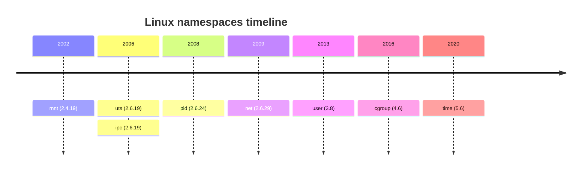

# Containers

## Table of contents

- [1. Why containers?](#1-why-containers)
    - [1.1. Motivation](#11-motivation)
    - [1.2. Containers v. virtual machines](#12-containers-v-virtual-machines)
- [2. How containers work](#2-how-containers-work)
    - [2.1. Namespaces](#21-namespaces)
    - [2.2. Control groups](#22-control-groups)
    - [2.3. Union filesystems](#23-union-filesystems)
    - [2.4. Networking](#24-networking)
- [3. Podman](#3-podman)
    - [3.1. Images](#31-images)
        - [3.1.1. Pulling images](#311-pulling-images)
        - [3.1.2. Building images](#312-building-images)
        - [3.1.3. Pushing images](#313-pushing-images)
    - [3.2. Containers](#32-containers)
        - [3.2.1. Running containers](#321-running-containers)
        - [3.2.2. Executing commands](#322-executing-commands)
        - [3.2.3. Managing containers](#323-managing-containers)
    - [3.3. Compose](#33-compose)
- [Glossary](#glossary)
- [Bibliography](#bibliography)
- [Licenses](#licenses)

## 1. Why containers?

### 1.1. Motivation

Containers are of particular interest to system administrators because they standardize software packaging.

Consider a typical web application developed in any modern language framework. This application typically consists of code, dependencies (each pinned to a specific version), interpreter or compiler (also version pinned), user accounts, environment settings, and services provided by the operating system.

A typical site runs dozens or hundreds of such applications. When dependencies conflict, applications cannot easily share the same host, so each runs in isolation — leaving hardware underutilized.

### 1.2. Containers v. virtual machines

Virtualization abstracts physical resources. A virtual machine (VM) abstracts physical hardware: the hypervisor provides each VM with a simulated set of hardware, and each VM runs its own kernel on top of it.

Containerization is a form of virtualization. A container is an operating-system-level abstraction. There is no simulated hardware and no guest kernel. Containers share the host's kernel — this is what makes them lightweight, but it also reduces the security boundary to the host kernel.

> [!warning]
> A vulnerability in the kernel can potentially affect all containers running on the same host.

## 2. How containers work

Containers rely on kernel features, layered filesystems, and virtual networking. A container engine (e.g., `docker`, `podman`) is the management software that pulls it all together.

Containerized applications are not aware of their containerized state and do not require modification.

Multiple containers can run on the same host, sharing the kernel while remaining logically isolated from one another. Each container bundles its own filesystem, dependencies, and binaries, so applications no longer compete for — or conflict over — shared system resources.

### 2.1. Namespaces



A namespace is a kernel feature that wraps a particular global system resource in an abstraction that makes it appear to the processes within the namespace that they have their own isolated instance of the global resource.

For example, a process in a new process identifier (PID) namespace is isolated from the host's process tree — it sees itself as PID 1 and only its own descendants are visible, as if it were the only process on the system.

---

The `unshare` command runs a program in new namespaces

```bash
$ echo $$
1234
$ sudo unshare --pid --fork sh -c 'echo $$'
1
```

- `--pid` creates a new PID namespace
- `--fork` ensures the program is forked into the new PID namespace and assigned PID 1

### 2.2. Control groups

A control group (cgroup) is a kernel feature that limits, accounts for, and isolates the resource usage (CPU, memory, I/O, etc.) of a collection of processes.

For example, a cgroup can cap the CPU usage of a running process to a fraction of the CPU actually available on the system.

Cgroups are exposed through the `/sys` filesystem. Like `/proc`, this is a pseudo filesystem — but where `/proc` exposes process and kernel state, `/sys` was designed specifically for configuring kernel objects: resources are configured by writing to files.

---

```bash
$ sudo mkdir /sys/fs/cgroup/yes
$ echo "25000 100000" | sudo tee /sys/fs/cgroup/yes/cpu.max
25000 100000
$ yes > /dev/null &
[1] 20245
$ ps -p 20245 -o %cpu
%CPU
99.9
$ echo 20245 | sudo tee /sys/fs/cgroup/yes/cgroup.procs
20245
```

This creates a cgroup (`/sys/fs/cgroup/yes`) and sets its CPU quota to 25% of one core (`cpu.max`). The `yes` process initially consumes ~100% of a core. After writing its PID to `cgroup.procs`, the kernel enforces the quota and CPU usage drops to ~25%.

### 2.3. Union filesystems

Typically, mounting a filesystem hides whatever was previously at that location. Union mounting works differently: multiple directories are combined into one that appears to contain their combined contents.

Container images rely on union filesystems. The layers are union-mounted into a single view that resembles the root filesystem of a typical Linux distribution.

An image is built from a stack of read-only layers, each representing an incremental change — such as installing a package or adding a configuration file.

---

When a container is created, a writable layer is added on top.

If a containerized process modifies a file, the file is not changed in the underlying read-only layer. Instead, it is copied up to the writable layer first, and the modification is applied there. This mechanism is known as copy-on-write.

> [!note]
> The writable layer is ephemeral — it is discarded when the container is removed. Any data written inside a container is lost by default.

### 2.4. Networking

Typically, the container engine creates a virtual bridge on the host — a network device that aggregates multiple network segments into one. This bridge serves as the backbone through which containers communicate.

Each container gets its own virtual network interface, which is attached to the bridge. Through the bridge, a container can reach other containers on the same host and access the internet via the host's physical network interface.

By default, however, containerized services are not reachable from outside the host. Port publishing maps a port on the host to a port inside the container, allowing external traffic to reach a containerized service.

## 3. Podman

[`podman`](https://github.com/containers/podman) is an open-source container engine.

In contrast to `docker`, where every container operation goes through a daemon (by default) running as root, `podman` is daemonless.

> [!warning]
> Clients communicate with the `docker` daemon through a [local domain socket](https://github.com/fglmtt/admin/blob/main/lectures/the-filesystem.md#57-local-domain-sockets) (`/var/run/docker.sock`). Access control relies on the socket's filesystem permissions only — there is no authentication. Any process that can write the socket can issue `docker` API calls freely. For example, an attacker could instruct the daemon to run a container with the host filesystem mounted, with `root` access to every file on the host.

---

`podman` supports rootless containers, which means that users can create and run containers without `root` privileges.

> [!note]
> Rootless containers run inside a user namespace, where `root` inside the container is mapped to the invoking user's user identifier (UID) on the host. Mounting the host filesystem still works, but the container's `root` can only access files that the invoking user can already access.

`podman` integrates with `systemd`. When configured as user services, rootless containers are managed by the per-user `systemd` instance and start on login like any other user service.

### 3.1. Images

#### 3.1.1. Pulling images

A container image registry is a server that stores and distributes container images — images are pulled from it and pushed to it. [Docker Hub](https://hub.docker.com/) is the default public registry.

Images are identified by a name and a tag, where the tag identifies a specific version of the image. If no tag is specified, `latest` is assumed. To pull the `ubuntu` container image, with version `24.04`, from Docker Hub

```shell
$ podman pull ubuntu:24.04
```

`podman images` shows all images stored locally. Use `podman rmi <image-id>` to remove a specific image. As images accumulate over time, `podman image prune --all` discards all images not referenced by any container.

#### 3.1.2. Building images

A Containerfile (aka Dockerfile) is a text file that describes how to build an image. Each instruction that modifies the filesystem adds a read-only layer on top of the previous one — the same layered model described in [§2.3](#23-union-filesystems). The result is a stack of layers that together form the container image.

To build a container image from a Containerfile

```shell
$ podman build -t <name>:<tag> -f <path/to/containerfile>
```

- `-t` tags the resulting image with a name and tag
- `-f` specifies the path to the Containerfile

#### 3.1.3. Pushing images

A registry organizes images into repositories — named collections of related images, typically different versions of the same application.

On Docker Hub, a repository has the form `<username>/<image-name>`, and a full image reference is `<username>/<image-name>:<tag>`. Before pushing, the image must be tagged to match the target registry and repository

```shell
$ podman tag <image-name>:<tag> <username>/<image-name>:<tag>
$ podman push <username>/<image-name>:<tag>
```

### 3.2. Containers

#### 3.2.1. Running containers

Every image defines a default command — the process that runs when the container starts. The container runs for as long as that process runs; when the process exits, the container stops. To run a container based on the `ubuntu:24.04` image

```shell
$ podman run ubuntu:24.04
$
```

> [!note]
> The container appears to do nothing. In reality, it started, ran the default command (`bash`), and exited immediately — `bash` received no terminal and no input, so it exited right away.

---

To override the default command, specify it as an argument

```shell
$ podman run ubuntu:24.04 echo "hello"
hello
```

To open an interactive shell inside a container

```shell
$ podman run -it ubuntu:24.04 bash
root@1006b4dd96cd:/#
```

- `-i` forwards the host's stdin to the container's stdin
- `-t` allocates a pseudo-terminal for the container so programs inside see a terminal and behave interactively

---

To run a container in the background, use `-d`

```shell
$ podman run -d ubuntu:24.04 sleep infinity
0f4b7a2c120193f28b6efa4568c0516465b384db919cbda3abb6db8ba7ea72fe
```

- `0f4b7a2c [...]` is the container ID

> [!tip]
> `sleep infinity` is passed as the command — it does nothing but keeps the container alive indefinitely. Without it, `bash` (the default command for `ubuntu:24.04`) would exit immediately, and so would the container. With the container running in the background, it can be reached at any time.

---

Files and directories can be mounted from the host into the container

```shell
$ podman run \
    -d \
    -v /home/ubuntu/data:/data:ro \
    ubuntu:24.04 \
    sleep infinity
```

- `-v` mounts `/home/ubuntu/data` (host) into `/data` (container) in read-only mode (`ro`). The default mode is `rw`

> [!note]
> Unlike the writable layer (see [§2.3](#23-union-filesystems)), data in a bind mount lives on the host — it persists after the container is removed.

#### 3.2.2. Executing commands

`podman exec` runs a command inside a running container. Consider the following container

```shell
$ podman run -d --name admin ubuntu:24.04 sleep infinity
```

- `--name` assigns a human-readable name (`admin`) at creation time, so the container can be referenced by name rather than container ID

To open an interactive shell

```shell
$ podman exec -it admin bash
root@a1b2c3d4e5f6:/#
```

#### 3.2.3. Managing containers

To show running containers

```shell
$ podman ps
CONTAINER ID  7a830634133e
IMAGE         docker.io/library/ubuntu:24.04
COMMAND       sleep infinity
CREATED       2 seconds ago
STATUS        Up 2 seconds
PORTS
NAMES         admin
```

By default, only running containers are shown. Use `-a` to show all containers (e.g., stopped containers).

---

To stop a running container

```shell
$ podman stop admin
WARN[0010] StopSignal SIGTERM failed to stop container admin in 10 seconds, resorting to SIGKILL
admin
```

The container still exists and can be restarted with `podman start`.

> [!note]
> `podman stop` sends SIGTERM to PID 1, then SIGKILL after a timeout. PID 1 ignores signals it has not registered a handler for — `sleep infinity` does not handle SIGTERM, hence the warning.

---

To remove a stopped container

```shell
$ podman rm admin
```

> [!note]
> When a container is removed, its writable layer is discarded and it cannot be restarted. However, the underlying image is not affected and can be used to create new containers. To remove an image, use `podman rmi`.

### 3.3. Compose

`podman-compose` manages multi-container applications. The Compose file (`compose.yaml`) describes the containers that make up the application and how they are interconnected.

To start all services

```shell
$ podman-compose -f <path/to/compose-file> up -d
```

- `-f` specifies the path to the Compose file
- `-d` starts the services in the background

---

Individual containers can be managed with the usual `podman` subcommands — `podman-compose` creates regular containers underneath.

To stop and remove them

```shell
$ podman-compose -f <path/to/compose-file> down
```

> [!note]
> In production, multi-container applications are typically managed by a container orchestrator such as Kubernetes, which handles scheduling, scaling, and fault tolerance across a cluster of hosts.

## Glossary

| Term                     | Meaning                                                                                                                                                                                                                                                                                    |
| ------------------------ | ------------------------------------------------------------------------------------------------------------------------------------------------------------------------------------------------------------------------------------------------------------------------------------------ |
| Bind mounting            | Mounting a file or directory from the host filesystem into a container                                                                                                                                                                                                                     |
| Compose file             | A YAML file that describes the containers and their interconnections in a multi-container application                                                                                                                                                                                      |
| Container                | An isolated environment that shares the host's kernel                                                                                                                                                                                                                                      |
| Container engine         | Software that manages the lifecycle of containers                                                                                                                                                                                                                                          |
| Container ID             | A unique identifier assigned to a container at creation time                                                                                                                                                                                                                               |
| Container image          | A stack of read-only layers that together form the root filesystem of a container                                                                                                                                                                                                          |
| Container registry       | A server that stores and distributes container images                                                                                                                                                                                                                                      |
| Container repository     | A named collection of related container images, typically different versions of the same application                                                                                                                                                                                       |
| Containerfile            | A text file that describes how to build a container image                                                                                                                                                                                                                                  |
| Containerization         | A form of virtualization that isolates applications at the operating-system level, without simulating hardware or running a guest kernel                                                                                                                                                   |
| Control group            | A Linux feature that allows processes to be organized into hierarchical groups whose usage of various types of resources can then be limited and monitored                                                                                                                                 |
| Copy-on-write            | A storage mechanism in which a file is copied to the writable layer before being modified, leaving the underlying read-only layer unchanged                                                                                                                                                |
| Daemon                   | A process that is often started when the system is bootstrapped and terminates only when the system is shut down. Daemons run in the background, i.e., they do not have a controlling terminal                                                                                             |
| `docker`                 | A container engine                                                                                                                                                                                                                                                                         |
| Filesystem               | A structure used by an OS to organize and manage files. Implementations range from disk partitions to network file servers and kernel-provided pseudo filesystems                                                                                                                          |
| Kernel                   | A computer program at the core of an operating system that controls the hardware resources of the computer and provides an environment under which programs can run                                                                                                                        |
| Local domain socket      | A form of inter-process communication. A local domain socket allows processes running on the same computer to communicate with each other. Local domain sockets are full-duplex (while pipes are half-duplex) and are more efficient than Internet domain sockets (no networking overhead) |
| Mounting                 | Attaching a filesystem to the file tree                                                                                                                                                                                                                                                    |
| Namespace                | A namespace wraps a global system resource in an abstraction that makes it appear to the processes within the namespace that they have their own isolated instance of that resource                                                                                                        |
| `podman`                 | A container engine                                                                                                                                                                                                                                                                         |
| `podman-compose`         | A tool for managing multi-container applications defined in a Compose file                                                                                                                                                                                                                 |
| Port publishing          | A mechanism that maps a port on the host to a port inside a container, allowing external traffic to reach a containerized process                                                                                                                                                          |
| Process                  | A program in execution                                                                                                                                                                                                                                                                     |
| Process identifier (PID) | A non-negative integer that uniquely identifies a process                                                                                                                                                                                                                                  |
| Root filesystem          | A filesystem mounted at `/`, providing the root directory of the system or container                                                                                                                                                                                                       |
| Rootless container       | A container that runs without `root` privileges, using a user namespace to map the container's `root` to the invoking user's UID on the host                                                                                                                                               |
| `systemd`                | The default system and service manager for most Linux distributions                                                                                                                                                                                                                        |
| Union mounting           | A form of mounting that combines multiple directories into a single view containing their combined contents                                                                                                                                                                                |
| Hypervisor               | Software that creates and runs VMs                                                                                                                                                                                                                                                         |
| Virtual machine (VM)     | An abstraction of physical hardware, providing each instance with a simulated set of hardware and its own kernel                                                                                                                                                                           |
| Virtualization           | The abstraction of physical resources through software                                                                                                                                                                                                                                     |

## Bibliography

| Author(s)         | Title                                                                   | Year |
| ----------------- | ----------------------------------------------------------------------- | ---- |
| Nemeth, E. et al. | [UNIX and Linux System Administration Handbook](https://www.admin.com/) | 2018 |
| Community         | [Wikipedia](https://en.wikipedia.org/)                                  | 2025 |

## Licenses

| Content | License |
| ------- | ------- |
| Code    | [MIT License](https://mit-license.org/) |
| Text    | [Creative Commons Attribution-NonCommercial-ShareAlike 4.0 International](https://creativecommons.org/licenses/by-nc-sa/4.0/) |
