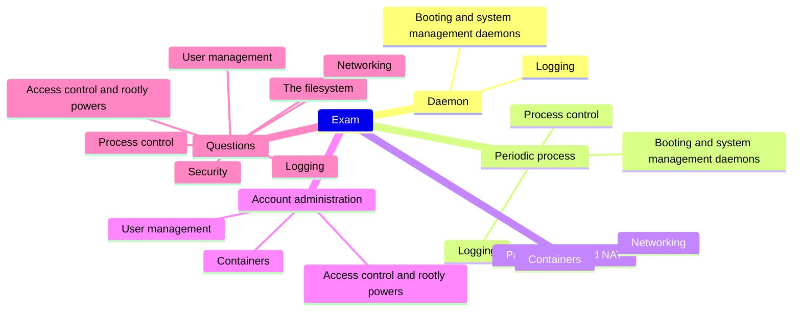
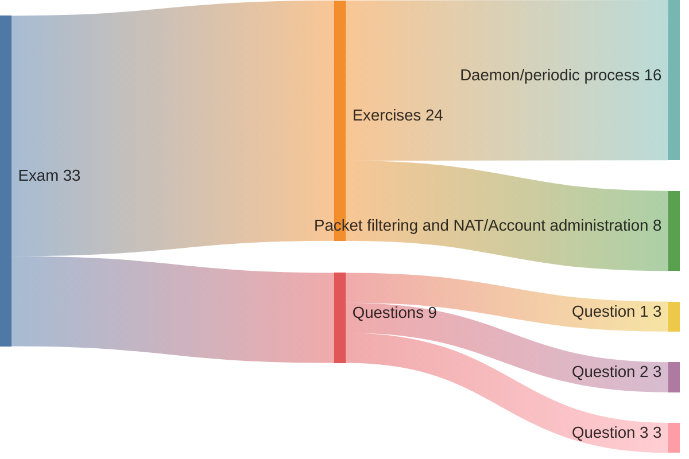
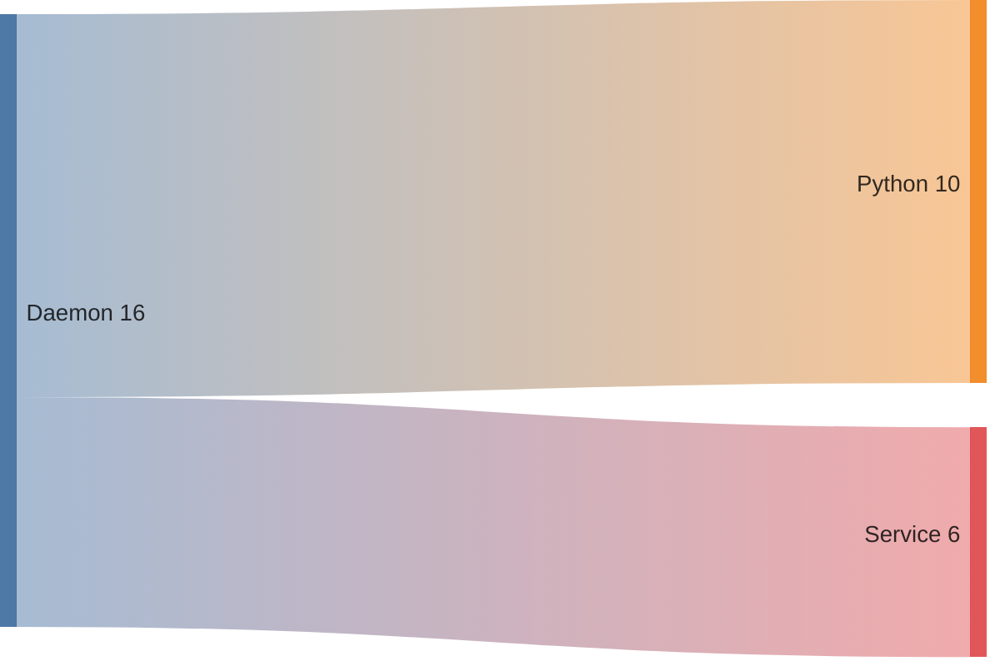
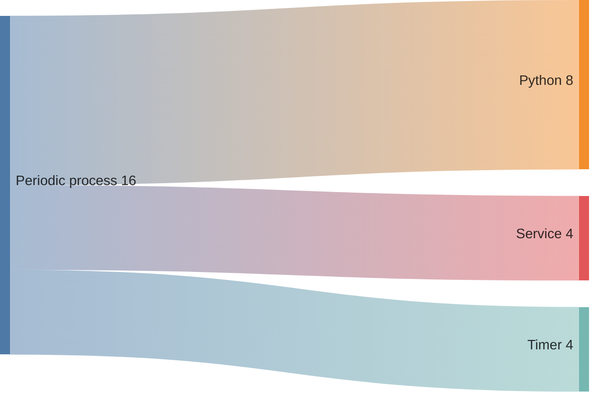

# Exam guide

## Table of contents

- [1. Overview](#1-overview)
- [2. Exercises](#2-exercises)
- [3. Questions](#3-questions)
    - [3.1. Logging](#31-logging)
    - [3.2. Process control](#32-process-control)
    - [3.3. Access control and rootly powers](#33-access-control-and-rootly-powers)
    - [3.4. The filesystem](#34-the-filesystem)
    - [3.5. User management](#35-user-management)
    - [3.6. Networking](#36-networking)
    - [3.7. Security](#37-security)
- [4. Scoring](#4-scoring)
- [Licenses](#licenses)

## 1. Overview

The exam consists of two exercises and three open questions. The two exercises are drawn from [§2](#2-exercises): one from the daemon/periodic process group and one from the packet filtering and NAT/account administration group. The three questions are drawn from the pool in [§3](#3-questions).

The time available is 2.5 hours.

The exam text is in Italian unless otherwise requested. Feel free to solve the exercises or answer the questions in either Italian or English.

> [!warning]
> If you would like the exam text in English, please let me know a few days in advance.

---

During the exam you may use

- Python documentation (`help`)
- Manual pages (`man`)
- [Cheat sheet](https://github.com/fglmtt/admin/blob/main/lectures/cheat-sheet.md)
- The [`up.sh`](https://github.com/fglmtt/admin/blob/main/code/up.sh) and [`down.sh`](https://github.com/fglmtt/admin/blob/main/code/down.sh) scripts
- The container image [`fglmtt/admin`](https://hub.docker.com/repository/docker/fglmtt/admin)

The exam environment has no internet connection. The container image is already present on the exam machines, and a link to download the scripts and cheat sheet from the intranet will be provided on the day of the exam.

> [!tip]
> Review the cheat sheet before the exam. If anything is missing, let me know so I can update it in advance.

---

## 2. Exercises

| Exercise | Previous exams |
| -------- | -------------- |
| Daemon | [2025-06-20](https://github.com/fglmtt/admin/blob/main/exams/2025-06-20/README.md), [2025-11-03](https://github.com/fglmtt/admin/blob/main/exams/2025-11-03/README.md), [2026-02-09](https://github.com/fglmtt/admin/blob/main/exams/2026-02-09/README.md) |
| Periodic process | [2025-06-16](https://github.com/fglmtt/admin/blob/main/exams/2025-06-16/README.md), [2025-07-11](https://github.com/fglmtt/admin/blob/main/exams/2025-07-11/README.md), [2025-09-08](https://github.com/fglmtt/admin/blob/main/exams/2025-09-08/README.md), [2026-01-09](https://github.com/fglmtt/admin/blob/main/exams/2026-01-09/README.md) |
| Packet filtering and NAT | [2025-06-16](https://github.com/fglmtt/admin/blob/main/exams/2025-06-16/README.md), [2025-06-20](https://github.com/fglmtt/admin/blob/main/exams/2025-06-20/README.md), [2025-07-11](https://github.com/fglmtt/admin/blob/main/exams/2025-07-11/README.md), [2025-09-08](https://github.com/fglmtt/admin/blob/main/exams/2025-09-08/README.md), [2025-11-03](https://github.com/fglmtt/admin/blob/main/exams/2025-11-03/README.md), [2026-01-09](https://github.com/fglmtt/admin/blob/main/exams/2026-01-09/README.md), [2026-02-09](https://github.com/fglmtt/admin/blob/main/exams/2026-02-09/README.md) |
| Account administration | — |

> [!warning]
> Account administration is a new exercise type introduced this year (2025/2026). There are no previous exam examples — refer to the [lab](https://github.com/fglmtt/admin/blob/main/lectures/account-administration.md) and [mock exam](https://github.com/fglmtt/admin/blob/main/lectures/mock-exam.md).

## 3. Questions

> [!tip]
> Try the NotebookLM I prepared to help you prepare the questions, available on Classroom. Type the question number you are interested in and you will get 
> - Full question text
> - Concise answer grounded in the lecture materials
> - Brief explanation of the reasoning as presented in the lectures

### 3.1. Logging

See [logging](https://github.com/fglmtt/admin/blob/main/lectures/logging.md).

1. Why do attackers tamper with log files, what is FSS, and how does it allow administrators to detect such tampering?
2. Why are administrators today required to maintain a centralized, hardened logging repository, what role do NTP-validated timestamps play, and which logging daemons handle local collection versus forwarding to the central repository?

### 3.2. Process control

See [process control](https://github.com/fglmtt/admin/blob/main/lectures/process-control.md).

3. What is a signal, which processes may a user send signals to, and what strategy should an administrator adopt to reliably stop a misbehaving process?
4. What are the limitations of indirect tools such as `ps` and logs when investigating a suspicious process, and what does `strace` reveal that they cannot?

### 3.3. Access control and rootly powers

See [access control and rootly powers](https://github.com/fglmtt/admin/blob/main/lectures/access-control-and-rootly-powers.md).

5. What core rules govern the traditional UNIX permission model?
6. What identities are associated with a process, and what role does each play?
7. What is set-UID execution, why does `passwd` need it, and what happens when a regular user runs `passwd`?
8. Why is `sudo` generally preferred to direct `root` login or `su` for obtaining `root` privileges, and what are its main advantages and drawbacks?

### 3.4. The filesystem

See [the filesystem](https://github.com/fglmtt/admin/blob/main/lectures/the-filesystem.md).

9. Which file types does UNIX support, and how do the nine permission bits (`rwx` for user, group, and other) govern the allowed operations on each type?
10. Why is a lazy unmount (`umount -l`) considered unsafe, which command lets you identify the processes that still hold references to the busy filesystem, and how can you perform a clean unmount instead?
11. What are the purposes of the set-UID, set-GID, and sticky bits, to which regular files or directories does each apply, and how do they alter permission checks?
12. Who may change a file's permission bits, which command can they use, and how is that command invoked?
13. Who may change a file's ownership (owner and group owner), what rules must be satisfied, and which command performs the operation?

### 3.5. User management

See [user management](https://github.com/fglmtt/admin/blob/main/lectures/user-management.md).

14. How can an administrator set an initial password for a new account, why is it risky to defer this to the user's first login, and which approach is recommended?
15. How can an administrator lock and unlock a user's account, how does the underlying mechanism work at the level of `/etc/shadow`, and what are the limitations of this approach?

### 3.6. Networking

See [networking](https://github.com/fglmtt/admin/blob/main/lectures/networking.md).

16. What is a firewall, how does a two-stage filtering scheme work, and what role does a DMZ play?
17. What is ARP spoofing, which weaknesses in the ARP protocol does it exploit, and what kind of attacks does it enable?
18. How can an attacker abuse ICMP redirect messages, which weaknesses in the ICMP protocol make this possible, and what kind of attacks does this enable?
19. What is IP forwarding, and why is it usually unsafe to leave it enabled on hosts that are not intended to act as routers?
20. What is IP spoofing, and what defences can be used against it?
21. What is IPv4 source routing, and how can an attacker exploit it?
22. How does a broadcast ping attack such as the smurf attack work, where does IP spoofing come into play, and how does Linux defend against it by default?

### 3.7. Security

See [security](https://github.com/fglmtt/admin/blob/main/lectures/security.md).

23. What does the CIA triad stand for in information security, and what does each principle mean?
24. What is social engineering, why is it particularly difficult to defend against, and what is one common form of this attack?
25. What is a software vulnerability, what is a specific example of such a vulnerability, and how can open-source code review practices help in reducing these vulnerabilities?
26. What is a DDoS attack, and how does it typically compromise the targeted systems?
27. What is insider abuse, and why is it often harder to detect than external attacks?
28. Why is keeping systems patched considered the administrator's highest-value security chore, what risks do patches themselves introduce, and what should a sound patching procedure include?
29. What is a backup in the context of computer security, and what are the key recommendations for effectively managing backups?
30. What are computer viruses and worms, and what are the key differences between these two types of malware?
31. What is a rootkit, how does it typically function, and why can it be particularly challenging to detect and remove?
32. What are the best practices and recommendations for creating secure passwords, managing passwords effectively, and implementing MFA?
33. What is symmetric key cryptography, how does it work, and what are its primary advantages and disadvantages?
34. What is public key cryptography, how does it work, and what are its primary advantages and disadvantages?
35. What is a CA, why is it necessary in a public key infrastructure, and why is it a high-value target?

## 4. Scoring

Each exam is graded out of 33 points.

The exam is passed with at least 18 points. Cum laude is awarded with at least 31.

> [!tip]
> Students may review their graded exam. First compare your submission with the published solutions; if something still does not make sense, get in touch to set up a meeting. Please do not request a meeting without having first consulted the solutions.

---

---

---

## Licenses

| Content | License |
| ------- | ------- |
| Code    | [MIT License](https://mit-license.org/) |
| Text    | [Creative Commons Attribution-NonCommercial-ShareAlike 4.0 International](https://creativecommons.org/licenses/by-nc-sa/4.0/) |
