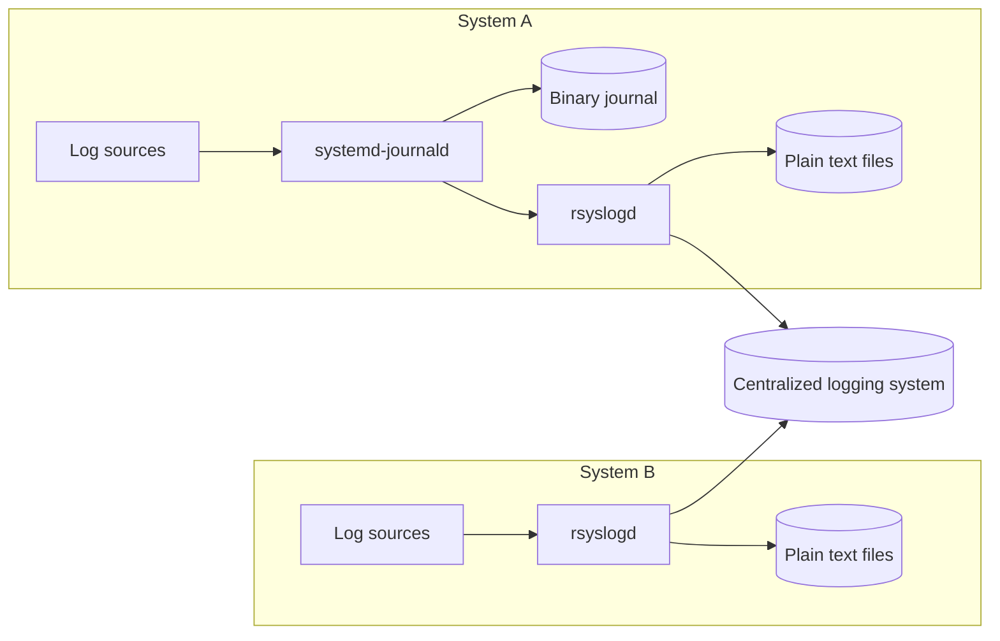

# Logging

## Table of contents

- [1. Overview](#1-overview)
    - [1.1. A bit of history](#11-a-bit-of-history)
    - [1.2. Log types and where to find them](#12-log-types-and-where-to-find-them)
    - [1.3. Good news and bad news](#13-good-news-and-bad-news)
- [2. The systemd journal](#2-the-systemd-journal)
    - [2.1. Configuration](#21-configuration)
        - [2.1.1. Persistence](#211-persistence)
        - [2.1.2. Tampering detection](#212-tampering-detection)
    - [2.2. Log sources](#22-log-sources)
    - [2.3. Viewing logs](#23-viewing-logs)
    - [2.4. Filtering options](#24-filtering-options)
    - [2.5. Coexisting with rsyslog](#25-coexisting-with-rsyslog)
- [3. Log file rotation](#3-log-file-rotation)
- [4. Management of logs at scale](#4-management-of-logs-at-scale)
- [Glossary](#glossary)
- [Bibliography](#bibliography)
- [Licenses](#licenses)

## 1. Overview

A log message is usually a line of text with a few properties attached, such as
- Timestamp
- Type and severity of the event
- Process name and process identifier (PID)

System daemons, the kernel, and user applications all emit operational data that eventually ends up stored as log messages on your finite-sized disks.

This data has a limited useful life and may need to be summarized, filtered, searched, analyzed, compressed, and archived before it is eventually discarded.

---

Log messages can range from innocuous warnings to critical error conditions. Some types of logs, such as access and audit logs, may need to be managed according to regulatory retention rules or site security policies.

Log management consists of
1. Collecting log messages from a variety of sources
2. Providing a structured interface for querying, analyzing, filtering, and monitoring log messages
3. Managing the retention and expiration of log messages so that information is kept as long as it is potentially useful or legally required, but not indefinitely

### 1.1. A bit of history

UNIX has historically managed logs through an integrated but somewhat rudimentary system, known as syslog, which offers a standardized interface for submitting log messages.

Upon reception, the syslog daemon (`syslogd`) sorts log messages and saves them to text files or forwards them to another host over the network. The modern implementation of syslog is rsyslog (`rsyslogd`).

Unfortunately, syslog tackles only the first of the logging chores listed above. Perhaps because of syslog's shortcomings, many programs bypass syslog entirely and write to their own ad hoc log files.

---

Linux's `systemd` journal is a second attempt to bring sanity to the logging madness. `systemd` includes a logging daemon called `systemd-journald`, which collects log messages, stores them in a binary format, and provides a command-line interface for viewing and filtering logs.

> [!failure]
> The `systemd` journal did not unify logging management. In practice, the two systems coexist:
> - The `systemd` journal manages log messages locally
> - Rsyslog forwards them to a centralized location

---



---

### 1.2. Log types and where to find them

UNIX is often criticized for being inconsistent, and indeed it is.

There is neither consistent naming nor consistent location on the filesystem. By default, most log files are found in `/var/log`, but some renegade applications write their log files elsewhere on the filesystem.

```shell
$ ls /var/log
[...] auth.log [...] faillog [...] journal/
```

---

Log files are generally owned by `root`, although conventions for the ownership and mode of log files vary. You might need to use `sudo` to view log files that have tight permissions.

```shell
$ ls -l /var/log
[...]
-rw-r-----  1 syslog   adm   [...] auth.log
[...]
-rw-r--r--  1 root     root  [...] faillog
[...]
```

---

Most log files are just text files to which lines are written as interesting events occur.

```shell
$ file /var/log/syslog
/var/log/syslog: ASCII text, with very long lines (580)
```

`cat`, `head`, `tail`, `less`, and `grep` are examples of commands that work well with text files.

---

Some log files are maintained in binary format. Do not treat them as text files—you may get garbage output or corrupt the terminal. Run `reset` to recover from a corrupted terminal.

```shell
$ file /var/log/wtmp
/var/log/wtmp: data
```

Some binary log formats have dedicated commands that decode them properly. For example, use `last` to read `/var/log/wtmp`.

### 1.3. Good news and bad news

> [!warning] Bad news
> Log management is the responsibility of administrators.
> 
> The importance of having a well-defined, site-wide logging strategy has grown along with the adoption of formal IT standards (e.g., [ISO/IEC 27001](https://en.wikipedia.org/wiki/ISO/IEC_27001)), as well as with the maturing of regulations for individual industries.
> 
> Today, administrators are typically required to maintain a centralized, hardened, enterprise-wide repository for log activity, with timestamps validated by [Network Time Protocol (NTP)](https://www.rfc-editor.org/rfc/rfc5905) and with a strictly defined retention schedule.

---

> [!tip] Good news
> When debugging problems and errors, experienced administrators turn to the logs sooner rather than later.
>
> Log files often contain important hints that point toward the source of vexing configuration errors, software bugs, and security issues.
>
> Logs are the first place you should look into when a daemon crashes or refuses to start, or when a chronic error plagues a system that is trying to boot.

## 2. The systemd journal

### 2.1. Configuration

The default configuration file is `/etc/systemd/journald.conf`. Here, you can find a commented-out version of every possible option, along with each option's default value.

> [!attention]
> Do not edit `/etc/systemd/journald.conf`.

Customized configurations go in the `/etc/systemd/journald.conf.d` directory. Any files placed there with a `.conf` extension are automatically incorporated into the configuration.

#### 2.1.1. Persistence

For example, the `Storage` option controls whether to save the journal to disk.

```shell
$ cat /etc/systemd/journald.conf | grep Storage
#Storage=auto
```

> [!attention]
> `auto` saves the journal in `/var/log/journal`, but does not create the directory if it does not exist. This is the default option in most Linux distributions and some do not come with the `/var/log/journal` directory out of the box. If so, the journal is not saved between reboots.

---

You can either create the directory or update the journal configuration.

```shell
$ mkdir /etc/systemd/journald.conf.d
$ cat << END > /etc/systemd/journald.conf.d/storage.conf
[Journal]
Storage=persistent
END
$ systemctl restart systemd-journald
```

> [!tip]
> `persistent` is like `auto`, but `/var/log/journal` is created if it does not already exist. This change is recommended for all systems. It is very inconvenient to lose all log data every time the system reboots.

#### 2.1.2. Tampering detection

Attackers may try to cover their tracks by tampering with log files. Forward secure sealing (FSS), a feature of the `systemd` journal, makes it possible to detect whether past journal entries have been tampered with.

FSS uses two keys:
- A sealing key, kept on the system and used to sign entries at each sealing interval
- A verification key, stored securely elsewhere and used to verify past seals

---

`systemd-journald` periodically signs batches of recent entries with a sealing key, generates a new sealing key, and discards the old one. Administrators can then use the verification key to verify any batch of sealed journal entries.

An attacker who gains access to the system can only see the current sealing key—past keys are gone, so sealed entries cannot be altered without detection.

> [!attention]
> By default, FSS is enabled (`Seal=yes`), but it has no effect until the key pair is generated.

---

```shell
$ sudo journalctl --setup-keys
[...]

New keys have been generated for host admin/523d9a25fa1d4ff4972ea58f707ecc34.

[...]

The sealing key is automatically changed every 15min.

Please write down the following secret verification key. It should be stored in a safe location and should not be saved locally on disk.

[...]
```

---

To verify the integrity of sealed journal entries

```shell
$ sudo journalctl \
    --verify \
    --verify-key=<verification-key>
[...]

PASS: /var/log/journal/523d9a25fa1d4ff4972ea58f707ecc34/user-1000@367c6dd314af45988c5c6914aa735711-0000000000003dad-00064bf65977b6f6.journal

[...]
```

### 2.2. Log sources

The `systemd` journal collects and indexes log messages from several sources.

| Source                        | Purpose                                                                             |
| ----------------------------- | ----------------------------------------------------------------------------------- |
| `/dev/log`                    | Socket used by software that submits log messages according to syslog conventions   |
| `/dev/kmsg`                   | Device file that provides access to the kernel log buffer                           |
| `/run/systemd/journal/stdout` | Socket used by software that writes log messages to standard output                 |
| `/run/systemd/journal/socket` | Socket used by software that submits log messages through the `systemd` journal API |

---

Every process started by `systemd` has its standard output and standard error wired to `/run/systemd/journal/stdout` by default. This means that any line a service writes there becomes a journal entry, automatically tagged with the service name and other metadata.

Services that want more expressive log entries, such as attaching custom structured fields, can instead submit messages to the journal via the `systemd` journal application programming interface (API); the `systemd` journal library communicates with `systemd-journald` through `/run/systemd/journal/socket`.

The first approach requires no `systemd`-specific logging code, but entries carry only the metadata that `systemd-journald` attaches automatically. The second requires importing the `systemd` journal library, but allows attaching arbitrary structured fields to each entry.

### 2.3. Viewing logs

The quickest and easiest way to view logs is to use `journalctl`, which prints messages from the `systemd` journal. You can view all messages in the journal, or pass the `-u` option to view the logs for a specific service unit.

```shell
$ journalctl -u rsyslog.service
[...]
Mar 01 13:17:21 admin systemd[1]: Started rsyslog.service - System Logging Service.
[...]
```

Pass the `-f` option to print new log messages as they arrive.

### 2.4. Filtering options

The `--list-boots` option shows
- A sequential list of system boots with numerical identifiers. The most recent boot is always 0
- The timestamps of the first and last message generated during each boot

```shell
$ journalctl --list-boots
```

---

You can then use the `-b` option to restrict the log display to a particular boot session. For example

```shell
$ journalctl -b 0 -u rsyslog.service
```

shows the logs
- Generated by `rsyslogd` (`-u rsyslog.service`)
- During the current session (`-b 0`)

---

To show all messages in a given time range, use the `--since` and `--until` options to set the lower and upper bound, respectively. These options accept timestamps in the format `YYYY-MM-DD HH:MM:SS` and a few shorthands such as `yesterday`, `today`, or `now`. For example

```shell
$ journalctl --since=today
```

shows all log messages from midnight of the current day (`--since=today`) up to and including the most recent log message in the `systemd` journal.

---

You can use the `-n` option to see the most recent log messages. If no number is given, the default is to show the last 10 log messages. For example

```shell
$ journalctl -n 5 -u rsyslog.service
```

shows
- The 5 most recent log messages (`-n 5`)
- Generated by `rsyslogd` (`-u rsyslog.service`)

---

Every log message carries a severity level, a classification of the urgency of the event. The eight standard syslog severities, from most to least urgent, are `emerg`, `alert`, `crit`, `err`, `warning`, `notice`, `info`, and `debug`.

The `-p` option filters messages by severity. It shows all messages at the given level and above (i.e., more severe). For example

```shell
$ journalctl -p err
```

shows all messages with severity `err`, `crit`, `alert`, or `emerg`.

### 2.5. Coexisting with rsyslog

The mechanics of the interaction between the `systemd` journal and rsyslog are somewhat convoluted. To begin with, `systemd-journald` takes over responsibility for collecting messages from `/dev/log`, the logging socket that was historically controlled by syslog. Therefore, rsyslog must get log messages through `systemd`.

The `systemd` journal defaults to `ForwardToSyslog=no`, which means that rsyslog consumes messages from the `systemd` journal API rather than from a logging socket.

When `ForwardToSyslog=yes`, the `systemd` journal forwards log messages to a dedicated socket, from which `rsyslogd` reads them.

## 3. Log file rotation

Log rotation is the practice of periodically replacing an active log file with a new, empty one. The old file is renamed, compressed, and archived for a defined retention period, after which it is deleted.

Left unchecked, log files grow without bound and can fill up a filesystem. Rotation keeps disk usage bounded and ensures that older, lower-value data does not displace more recent entries.

The `systemd` journal takes care of rotating logs automatically. The standard tool for log rotation outside `systemd` is `logrotate`.

## 4. Management of logs at scale

It's one thing to capture log messages, store them on disk, and forward them to a central server. It's another thing entirely to handle logging data from hundreds or thousands of servers.

At this scale (terabytes of log messages per day), providing a structured interface for querying, analyzing, filtering, and monitoring is far beyond what plain text files and standard command-line tools can support.

A variety of third-party platforms are purpose-built for this scale. In this regard, a well-known example is the ELK stack: [Elasticsearch](https://github.com/elastic/elasticsearch), [Logstash](https://github.com/elastic/logstash), and [Kibana](https://github.com/elastic/kibana).

## Glossary

| Term                                    | Meaning                                                                                                                                                                                        |
| --------------------------------------- | ---------------------------------------------------------------------------------------------------------------------------------------------------------------------------------------------- |
| Access log                              | A log that records each request to a resource                                                                                                                                                  |
| Application programming interface (API) | A defined set of functions or protocols through which software components interact                                                                                                             |
| Audit log                               | A log that records security-relevant events                                                                                                                                                    |
| Daemon process                          | A process that is often started when the system is bootstrapped and terminates only when the system is shut down. Daemons run in the background, i.e., they do not have a controlling terminal |
| Device file                             | A type of file that lives in the `/dev` directory that lets processes communicate with devices. Requests for a device file are passed to the related device driver                              |
| Forward secure sealing (FSS)            | A `systemd` journal feature that uses rotating cryptographic keys to detect tampering with past journal entries                                                                                |
| ISO/IEC 27001                           | An international standard for information security management systems                                                                                                                          |
| `journalctl`                            | A command-line tool for querying, filtering, and displaying entries from the `systemd` journal                                                                                                 |
| Kernel                                  | A computer program at the core of an operating system that controls the hardware resources of the computer and provides an environment under which programs can run                            |
| Log file                                | A file in which log messages are stored                                                                                                                                                        |
| Log management                          | The set of practices covering collection, querying, analyzing, filtering, monitoring, retention, and expiration of log messages                                                                |
| Log message                             | A record of an event emitted by a process, daemon, or the kernel, typically carrying a timestamp, severity, and process name                                                                   |
| Log rotation                            | The practice of periodically archiving and replacing active log files to keep disk usage bounded                                                                                               |
| `logrotate`                             | A tool for automating log rotation outside `systemd`; configures rotation schedules, compression, and retention per file                                                                       |
| Network Time Protocol (NTP)             | A protocol for synchronizing clocks across networked systems                                                                                                                                   |
| Process                                 | A program in execution                                                                                                                                                                         |
| Process identifier (PID)                | A non-negative integer that uniquely identifies a process                                                                                                                                      |
| `rsyslog`                               | The modern implementation of syslog                                                                                                                                                            |
| Service                                 | A unit that represents one or more processes                                                                                                                                                   |
| Severity                                | A classification of the urgency of a log message                                                                                                                                               |
| Socket                                  | A form of network inter-process communication. A socket is full-duplex. Sockets allow processes to communicate with each other, regardless of where they are running                           |
| `syslog`                                | A centralized logging facility that provides a standardized interface for submitting log messages; historically managed by `syslogd`                                                           |
| `systemd`                               | The default system and service manager for most Linux distributions                                                                                                                            |
| `systemd-journald`                      | The logging daemon included with `systemd`                                                                                                                                                     |
| Timestamp                               | A sequence of characters or encoded information identifying when a certain event occurred, usually giving the date and time of day                                                             |
| Unit                                    | An entity managed by `systemd`                                                                                                                                                                 |

## Bibliography

| Author(s)         | Title                                                                   | Year |
| ----------------- | ----------------------------------------------------------------------- | ---- |
| Nemeth, E. et al. | [UNIX and Linux System Administration Handbook](https://www.admin.com/) | 2018 |
| Community         | [Wikipedia](https://en.wikipedia.org/)                                  | 2025 |

## Licenses

| Content | License |
| ------- | ------- |
| Code    | [MIT License](https://mit-license.org/) |
| Text    | [Creative Commons Attribution-NonCommercial-ShareAlike 4.0 International](https://creativecommons.org/licenses/by-nc-sa/4.0/) |
