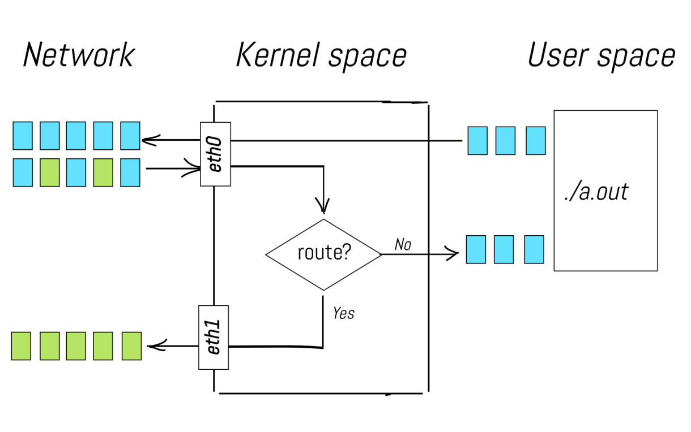
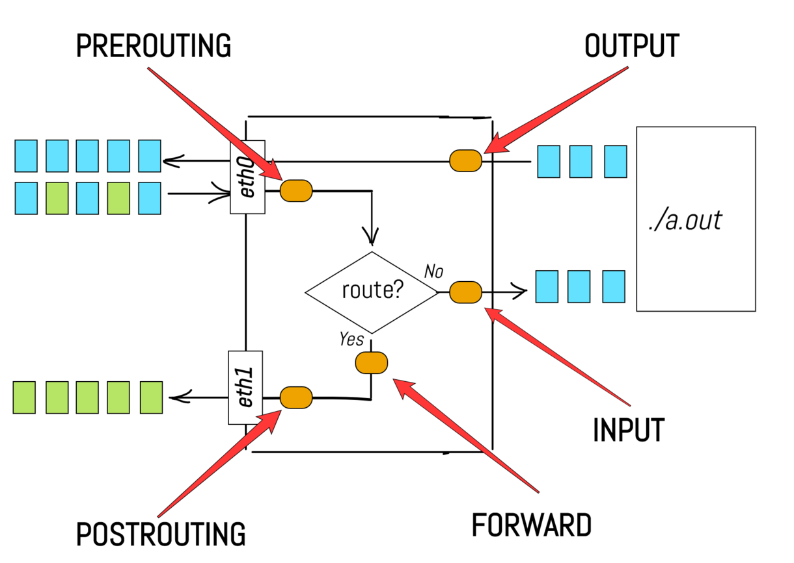
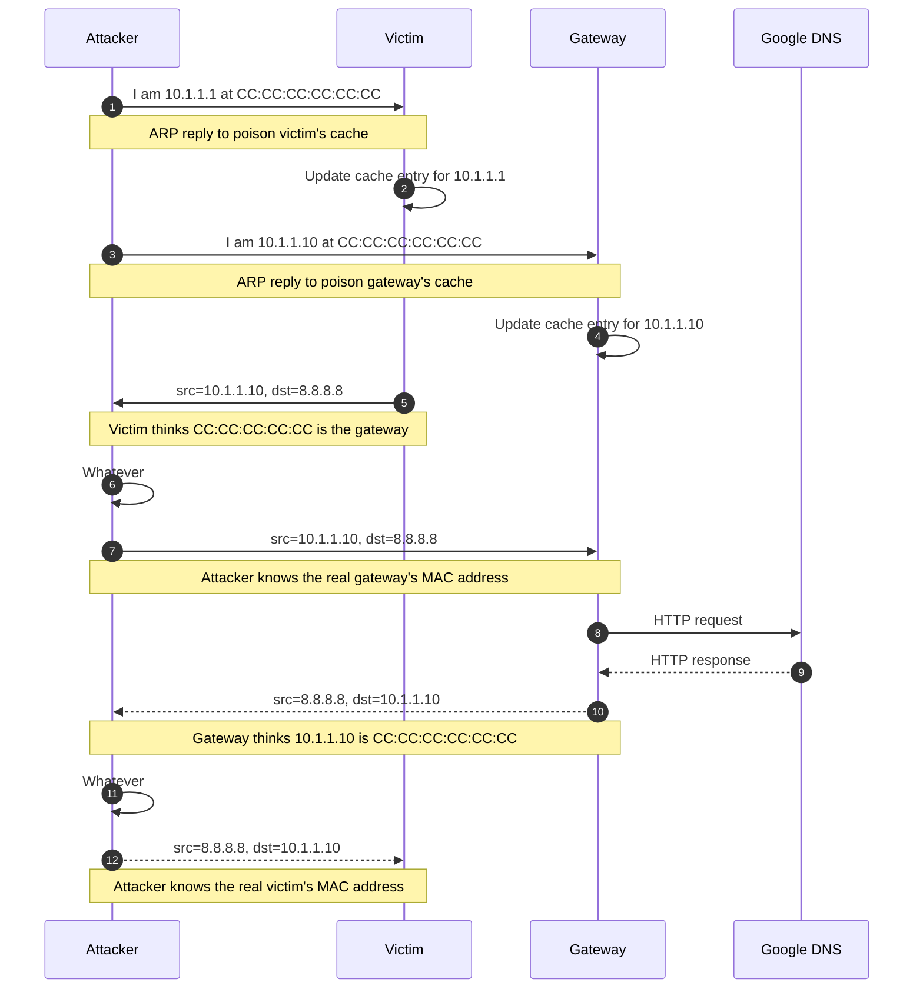
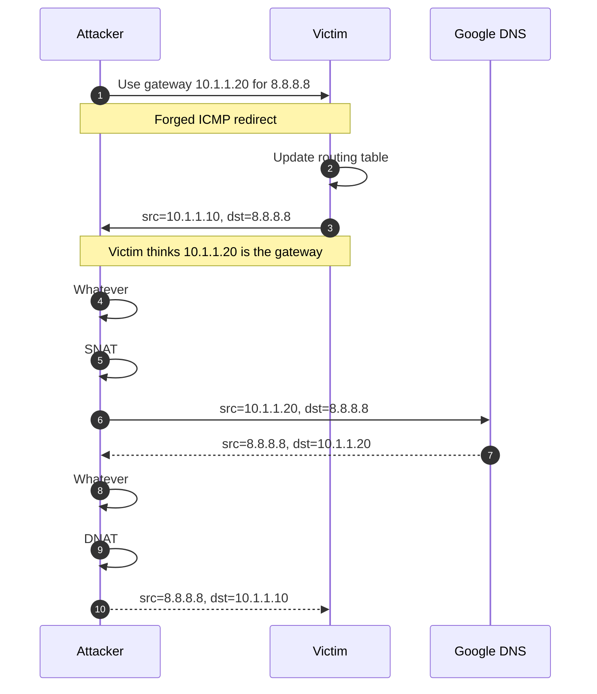
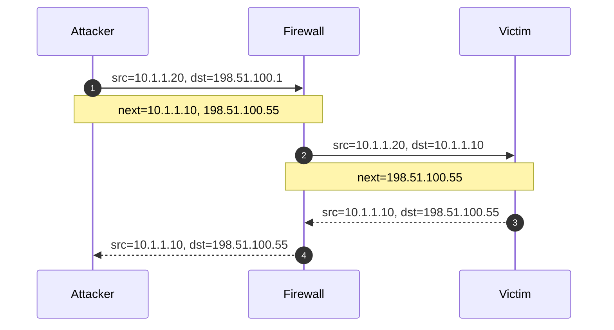

# Networking

## Table of contents

- [1. Firewalls](#1-firewalls)
    - [1.1. Linux iptables](#11-linux-iptables)
        - [1.1.1. Chains](#111-chains)
        - [1.1.2. Tables](#112-tables)
        - [1.1.3. Rules](#113-rules)
        - [1.1.4. A complete example](#114-a-complete-example)
- [2. Network troubleshooting](#2-network-troubleshooting)
    - [2.1. Checking if a host is alive](#21-checking-if-a-host-is-alive)
    - [2.2. Tracing IP packets](#22-tracing-ip-packets)
    - [2.3. Sniffing packets](#23-sniffing-packets)
    - [2.4. Testing port reachability](#24-testing-port-reachability)
- [3. Security issues](#3-security-issues)
    - [3.1. ARP spoofing](#31-arp-spoofing)
    - [3.2. ICMP redirects](#32-icmp-redirects)
    - [3.3. IP forwarding](#33-ip-forwarding)
    - [3.4. IP spoofing](#34-ip-spoofing)
    - [3.5. Source routing](#35-source-routing)
    - [3.6. Broadcast pings](#36-broadcast-pings)
- [Glossary](#glossary)
- [Bibliography](#bibliography)
- [Licenses](#licenses)

## 1. Firewalls

A packet-filtering firewall limits the type of traffic that can pass through your Internet gateway (or through an internal gateway that separates domains within your organization) according to information in the packet header.

Packet-filtering software is included in Linux in the form of `iptables` (and its easier-to-use front end, `ufw`). Although these machine-specific firewalls are capable of sophisticated filtering and bring a welcome extra dose of security, it is not a good idea to use a general-purpose OS as a firewall router.

> [!warning]
> The complexity of general-purpose OSes makes them inherently less secure and less reliable than task-specific devices. Use dedicated firewall appliances for site-wide network protection.

---

Most well-known services are associated with a network port in the `/etc/services` file. Service-specific filtering is predicated on the assumption that the client uses a non-privileged port to contact a privileged port on the server.

For example, if you want to allow only inbound Hypertext Transfer Protocol (HTTP) connections to a machine with the address `192.108.21.200`, install a filter that 
- Allows inbound Transmission Control Protocol (TCP) packets destined for port `80` at that address
- Allows outbound TCP packets from port `80` of that address to anywhere

---

Modern security-conscious sites use a two-stage filtering scheme. One filter is the gateway to the internet, and a second filter lies between the outer gateway and the rest of the local network.

The idea is to have inbound Internet connections terminate on systems that are administratively separate from the rest of the network. This network segment is usually called demilitarized zone (DMZ).

The most secure way to use a packet filter is to start with a configuration that allows no inbound connections, liberalize the filter bit by bit as you discover things that don't work, and move any Internet-accessible services onto systems in the DMZ.

### 1.1. Linux iptables

Netfilter is a framework provided by Linux that allows various networking-related operations, such as packet filtering and network address translation (NAT). Netfilter
- Defines specific points (called hooks) in the network stack
- Allows kernel modules to register their own functions (called callbacks) to these hooks
- Automatically triggers these callbacks when packets reach the corresponding hooks

The `iptables` command is a user-space utility that allows system administrators to configure Netfilter by defining rules for how packets should be handled.

#### 1.1.1. Chains



[Illustrated introduction to Linux iptables](https://iximiuz.com/en/posts/laymans-iptables-101/)

---



[Illustrated introduction to Linux iptables](https://iximiuz.com/en/posts/laymans-iptables-101/)

---

In the `iptables` world, hooks are called chains 

| Chain         | Target traffic | When                                                    |
| ------------- | -------------- | ------------------------------------------------------- |
| `PREROUTING`  | Incoming       | Before routing                                          |
| `INPUT`       | Incoming       | After routing, for packets destined to the local system |
| `FORWARD`     | Transit        | After routing, for packets being forwarded              |
| `POSTROUTING` | Outgoing       | After routing, just before packets leave the system     |
| `OUTPUT`      | Outgoing       | After routing, for locally-generated packets            |

#### 1.1.2. Tables

Sets of chains make up a table, and each table is used to handle a specific kind of packet processing, such as packet filtering or NAT

| Table    | Chain                                     | Scope                                                                               |
| -------- | ----------------------------------------- | ----------------------------------------------------------------------------------- |
| `filter` | `INPUT`, `FORWARD`, and `OUTPUT`          | Decide whether packets are allowed or blocked                                       |
| `nat`    | `PREROUTING`, `OUTPUT`, and `POSTROUTING` | Modify the source (SNAT) or destination (DNAT) IP addresses and/or ports of packets |

Chains with the same name in different tables act independently. Typically, the precedence is `nat` $\rightarrow$ `filter`.

#### 1.1.3. Rules

Callbacks are functions registered at specific hook points in the networking stack (e.g., `PREROUTING`, `FORWARD`, etc.). These callbacks are responsible for processing packets as they pass through the system.

Rules configure how these callbacks behave. Each rule has a target clause, which determines what to do with the matching packets. When a packet matches a rule, its fate is in most cases sealed; no additional rules are checked.

The targets available to rules vary depending on the table.

---

Common targets used for packet filtering (`filter` table)

| Target   | Description                                                        |
| -------- | ------------------------------------------------------------------ |
| `ACCEPT` | Allow the packet to proceed on its way                             |
| `DROP`   | Silently discard the packet                                        |
| `REJECT` | Drop the packet and return an ICMP error message                   |
| `LOG`    | Track the matching packet (rule evaluation continues)              |

---

Common targets used for network address and port translation (`nat` table) 

| Target       | Description                                       |
| ------------ | ------------------------------------------------- |
| `DNAT`       | Change destination IP address and/or port         |
| `SNAT`       | Changes source IP address and/or port             |
| `MASQUERADE` | Dynamic SNAT                                      |
| `REDIRECT`   | Redirect the packet to a local port on the system |
| `LOG`        | Track the matching packet (rule evaluation continues) |

#### 1.1.4. A complete example

Suppose your firewall has two interfaces

| NIC    | IP (CIDR)          | Scope                     |
| ------ | ------------------ | ------------------------- |
| `eth0` | `10.1.1.1/24`      | Go to an internal network |
| `eth1` | `128.138.101.4/24` | Go to the Internet        |

On the internal network there is an admin host (`10.1.1.100`) and a web server (`10.1.1.2`) listening on port `8080`.

---

The most secure strategy is to drop any packets you have not explicitly allowed. This means
- Flush all chains in the `filter` and `nat` tables (`-F`)
- Set a policy (`-P`) to make `DROP` the default target for `INPUT` and `FORWARD` chains in the `filter` table

```shell
$ iptables -F
$ iptables -t nat -F
$ iptables -P INPUT DROP
$ iptables -P FORWARD DROP
```

> [!note]
> The `OUTPUT` policy is left at the default `ACCEPT`. The firewall is trusted to send whatever it likes, including the replies to admitted inbound traffic.

---

The only TCP traffic that makes sense to allow to the firewall (`10.1.1.1`) is SSH from the admin host (`10.1.1.100`), which is useful for managing the firewall itself

```shell
$ iptables -A INPUT -i eth0 -s 10.1.1.100 \
    -d 10.1.1.1 -p tcp --dport 22 -j ACCEPT
```

This command appends (`-A`) a rule to the `INPUT` chain of the `filter` table. This rule matches TCP packets (`-p`) coming in through the `eth0` interface (`-i`) with source IP `10.1.1.100` (`-s`), destination IP `10.1.1.1` (`-d`), and destination port `22` (`--dport`). Matching packets are accepted (`-j`).

---

It is also useful to allow Internet Control Message Protocol (ICMP) traffic to the firewall from the internal network. This allows hosts in the `10.1.1.0/24` subnet to `ping` their default gateway

```shell
$ iptables -A INPUT -i eth0 -d 10.1.1.1 \
    -p icmp -j ACCEPT
```

This command appends (`-A`) a rule to the `INPUT` chain of the `filter` table. This rule matches ICMP packets (`-p`) coming in through the `eth0` interface (`-i`) with destination IP `10.1.1.1` (`-d`). Matching packets are accepted (`-j`).

---

The internal network is considered trusted. Therefore, the firewall must allow all connections that originate from within the internal network

```shell
$ iptables -A FORWARD -i eth0 -j ACCEPT
```

This command appends (`-A`) a rule to the `FORWARD` chain of the `filter` table. This rule matches packets coming in through `eth0`. Matching packets are accepted (`-j`).

> [!note]
> This only matches packets entering on `eth0` (the internal interface), so it does not cover the reply traffic coming back from the Internet on `eth1`.

---

As the internal network uses a private IP address range (i.e., `10.1.1.0/24`), NAT is required for outgoing connections to be routable on the public internet

```shell
$ iptables -t nat -A POSTROUTING -o eth1 \
    -j SNAT --to-source 128.138.101.4
```

This command appends (`-A`) a rule to the `POSTROUTING` chain of the `nat` table (`-t`). This rule matches packets going out on the `eth1` interface (`-o`). The source IP address (`-j`) of the matching packets is changed to `128.138.101.4` (`--to-source`).

---

It is also desirable that when someone from the internal network opens a connection, they can receive the response

```shell
$ iptables -A FORWARD -m conntrack \
    --ctstate ESTABLISHED,RELATED -j ACCEPT
```

This command appends (`-A`) a rule to the `FORWARD` chain of the `filter` table. This rule matches packets that are part of an already established connection or related to one (`--ctstate`) and accepts them (`-j`). The `conntrack` module (`-m`) monitors and records the state of all network connections passing through the system.

---

External clients reach the web server through the firewall's public address on port `80`. Destination NAT (DNAT) rewrites the destination of those packets to `10.1.1.2:8080`

```shell
$ iptables -t nat -A PREROUTING -i eth1 \
    -p tcp --dport 80 -j DNAT --to-destination 10.1.1.2:8080
```

This rule lives in the `nat` table (`-t`) and rewrites the destination of inbound TCP packets on `eth1` (`-i`) with destination port `80` (`--dport`) to `10.1.1.2:8080` (`--to-destination`).

---

Since DNAT runs before the `FORWARD` chain, the firewall must let the rewritten packets through on the post-DNAT port (`8080`), not the original (`80`)

```shell
$ iptables -A FORWARD -d 10.1.1.2 -p tcp \
    --dport 8080 -j ACCEPT
```

This rule appends (`-A`) to the `FORWARD` chain of the `filter` table and matches TCP packets (`-p`) with destination IP `10.1.1.2` (`-d`) and destination port `8080` (`--dport`). 

## 2. Network troubleshooting

### 2.1. Checking if a host is alive

The `ping` command sends an ICMP echo request to a target host and waits to see if the host answers back

```shell
$ ping www.google.com
PING www.google.com (142.251.209.4) [...]
64 bytes from [...] (142.251.209.4): icmp_seq=1 ttl=117 time=7.77 ms

[...]

64 bytes from [...] (142.251.209.4): icmp_seq=5 ttl=117 time=7.82 ms
^C
--- www.google.com ping statistics ---
5 packets transmitted, 5 received, 0% packet loss, time 4005ms
rtt min/avg/max/mdev = 7.773/7.969/8.186/0.169 ms
```

---

Use `ping` to check the status of individual hosts and to test segments of the network. 

> [!note]
> Routing tables, physical networks, and gateways are all involved in processing an ICMP echo request message. Therefore, the network must be more or less working for `ping` to succeed. If `ping` does not work, you can be pretty sure nothing more sophisticated will work either.

> [!tip]
> If your network is in a bad shape, chances are that Domain Name System (DNS) is not working. Use a numeric IP address as the target to skip the forward lookup, and pass `-n` to suppress the reverse lookup that `ping` performs on each reply.

---

> [!warning]
> Remember that
> - Some networks block ICMP echo requests with a firewall
> - It is hard to distinguish the failure of a network from the failure of a server. A failed ICMP echo request just tells you that something is wrong
> - A successful `ping` just tells you that the target host is powered on (ICMP echo requests are handled by the kernel within the IP protocol stack)

### 2.2. Tracing IP packets

The `traceroute` command shows the sequence of gateways through which an IP packet travels to reach its destination. `traceroute` works by setting the TTL field of an outbound packet to an artificially low number. When a gateway decreases the TTL to 0, it discards the packet and sends an ICMP Time Exceeded message back to the originating host

```shell
$ traceroute 8.8.8.8
traceroute to 8.8.8.8 (8.8.8.8), 30 hops max, 60 byte packets
 1  r16.endif.man (10.16.0.1)  0.498 ms  0.449 ms  0.465 ms
 2  gw-fe.unife.it (192.167.209.1)  1.369 ms  1.659 ms  1.946 ms

[...]

 9  dns.google (8.8.8.8)  7.622 ms  7.617 ms  7.582 ms
```

---

The first packets have TTL set to 1. The first gateway to see them determines that the TTL has been exceeded, drops them, and sends back an ICMP error message. The sender's IP address (`10.16.0.1`) in the header of that message identifies the gateway, which `traceroute` then resolves to a hostname (`r16.endif.man`) via DNS.

To identify the second-hop gateway, `traceroute` sends out a second round of packets with TTL set to 2. The first gateway forwards them and decreases their TTL by 1. At the second gateway (`gw-fe.unife.it`), the packets are dropped and an ICMP error message is generated as before.

This process continues until the TTL matches the number of hops to the destination host and the packets reach their destination successfully.

### 2.3. Sniffing packets

A packet sniffer is a tool that listens to network traffic and records or prints packets that meet criteria of your choice. It is a good idea to take an occasional sniff of your network to make sure the traffic is in order.

> [!note]
> Network hardware normally only relays broadcast, multicast, and locally-addressed packets to the kernel. To intercept the rest, the network interface must run in promiscuous mode, which lets the kernel read all packets on the network.

Since packet sniffers read data from a raw network device, they must run as `root`.

---

The `tcpdump` command is a command-line packet sniffer. `tcpdump` has long been the industry-standard packet sniffer. `tcpdump` understands many of the packet formats used by standard network services, and it can print these packets in human-readable form (or write them to a file). For example

```shell
$ sudo tcpdump -i ens3 arp
16:06:05 ARP, Request who-has admin tell r16.endif.man, length 46
16:06:05 ARP, Reply admin is-at fa:16:3e:cd:d5:f0, length 28
```

captures ARP traffic (filter expression `arp`) on the `ens3` interface (`-i`). The output shows an ARP request and the corresponding reply.

---

Wireshark is `tcpdump` on steroids. Wireshark includes both a GUI and a command-line interface (`tshark`).

Both Wireshark and `tcpdump` use the same underlying `libpcap` library, but Wireshark has more features, such as
- Display filters, which affect what you see rather than what is actually captured by the sniffer
- Built-in dissectors for a wide variety of network protocols. These dissectors break packets into a structured tree of information in which every bit of the packet is described in plain English

### 2.4. Testing port reachability

Before testing reachability from another host, it is often useful to verify locally that something is actually listening on the port. The `ss` command shows socket statistics

```shell
$ ss -tlnp
```

shows all TCP (`-t`) listening sockets (`-l`) without resolving port numbers to service names (`-n`), along with the process that owns each socket (`-p`).

---

The `nc` (netcat) command opens arbitrary TCP or UDP connections. For example

```shell
$ nc -l 1234
```

listens (`-l`) for an incoming TCP connection on port `1234`. Use the `-u` option to listen on UDP instead of TCP. Then, connect from another host

```shell
$ nc 10.10.10.10 1234
hello
```

Anything typed on either side appears on the other.

## 3. Security issues

### 3.1. ARP spoofing

When an IP packet is sent from one computer to another, the destination IP address must be resolved to a Media Access Control (MAC) address.

This is where Address Resolution Protocol (ARP) comes into play
1. When someone (say, `10.1.1.10`) does not know the MAC address of the destination IP (say, `10.1.1.1`), it broadcasts an ARP request to the local network. For example, `Who has 10.1.1.1?  Tell 10.1.1.10`
2. `10.1.1.1` responds with its own MAC address in an ARP reply
3. Upon receiving the ARP reply, `10.1.1.10` updates its cache of known neighbors (`ip neigh` shows these entries)

---

> [!warning]
> However
> - ARP is a stateless protocol, so ARP replies are automatically cached regardless of whether they actually follow any ARP request
> - There is no authentication in ARP
>
> Therefore, anyone can send an unsolicited ARP reply that rewrites a victim’s cache with false information

Typically, the attacker's goal is to associate the attacker's MAC address with the IP address of another host, such as the default gateway, causing any traffic meant for that IP address to be sent to the attacker instead.

---

The attacker's goal is to intercept the communication between a victim and the gateway (i.e., a man-in-the-middle (MITM) attack)

| Address              | Value               |
| -------------------- | ------------------- |
| Victim MAC address   | `AA:AA:AA:AA:AA:AA` |
| Victim IP address    | `10.1.1.10`         |
| Gateway MAC address  | `BB:BB:BB:BB:BB:BB` |
| Gateway IP address   | `10.1.1.1`          |
| Attacker MAC address | `CC:CC:CC:CC:CC:CC` |
| Google DNS           | `8.8.8.8`           |

---



### 3.2. ICMP redirects

An ICMP redirect is a control message sent by an Internet Protocol version 4 (IPv4) router to a host when the router successfully forwards one of the host’s packets but notices that there is a better first-hop for that destination on the same link.

When that happens
1. The router notifies the sender by sending an ICMP redirect message, which says "you should not be sending packets for host `xxx` to me, you should send them to host `yyy` instead"
2. The sender adjusts its routing table accordingly to fix the issue

> [!warning]
> However, ICMP redirects contain no authentication information.

---

The attacker's goal is to intercept the communication between a victim and the gateway (i.e., a MITM attack)

| Address             | Value       |
| ------------------- | ----------- |
| Gateway IP address  | `10.1.1.1`  |
| Victim IP address   | `10.1.1.10` |
| Attacker IP address | `10.1.1.20` |
| Google DNS          | `8.8.8.8`   |

---



---

By default, Linux accepts ICMP redirects

```shell
$ grep -H . /proc/sys/net/ipv4/conf/*/accept_redirects
/proc/sys/net/ipv4/conf/all/accept_redirects:1
/proc/sys/net/ipv4/conf/default/accept_redirects:1
/proc/sys/net/ipv4/conf/ens3/accept_redirects:1
/proc/sys/net/ipv4/conf/lo/accept_redirects:1
```

- `all`: every network interface accepts ICMP redirects
- `default`: the default choice when configuring a new network interface is to accept ICMP redirects
- `ens3`: the `ens3` network interface accepts ICMP redirects
- `lo`: the `lo` loopback interface accepts ICMP redirects

---

However, Linux accepts ICMP redirects if and only if they come from a host in the default gateway list. This is controlled by `secure_redirects` (also enabled by default in `/proc/sys/net/ipv4/conf/*/secure_redirects`).

> [!tip]
> Therefore, configure routers (and hosts acting as routers, see [§3.3](#33-ip-forwarding)) to ignore (perhaps except those coming from a default gateway) and log ICMP redirects.
> 
> Drop a file in `/etc/sysctl.d` (say, `99-icmp-redirects.conf`) that sets `accept_redirects`, `secure_redirects`, and `send_redirects` to `0` for both `all` and `default` under `net.ipv4.conf`. Apply with `sudo sysctl --system` (or reboot).

### 3.3. IP forwarding

A host that has IP forwarding enabled can act as a router. This means that it can accept third party packets on one network interface, match them to a gateway or destination host on another network interface, and retransmits the packets.

By default, IP forwarding is disabled on Linux

```shell
$ cat /proc/sys/net/ipv4/ip_forward
0
```

Add a drop-in file in `/etc/sysctl.d` to enable (`net.ipv4.ip_forward=1`) or disable (`net.ipv4.ip_forward=0`) IP forwarding, and make the kernel reload configuration files (`sysctl --system`)

---

> [!warning]
> Hosts that forward packets can sometimes be coerced into compromising security by making external packets appear to have come from inside the network, thus evading network scanners and packet filters.
> 
> ARP spoofing (see [§3.1](#31-arp-spoofing)) and ICMP redirects (see [§3.2](#32-icmp-redirects)) can be used to steer traffic toward a host with IP forwarding enabled rather than the legitimate gateway.

> [!tip]
> Unless your system is actually supposed to function as a router, it is best to turn IP forwarding off. It is perfectly acceptable for a host to have network interfaces on multiple subnets and to use them for its own traffic without forwarding third party packets.

### 3.4. IP spoofing

The source address on an IP packet is normally filled in by the kernel's TCP/IP implementation with the IP address of the host from which the packet is sent.

> [!warning]
> If the software that creates the packet uses a raw socket (`SOCK_RAW`), it can fill in any source address it likes.

> [!tip]
> Block outgoing packets whose source address is not within your address space. This protects against attackers forging the source address on external packets to fool your firewall into thinking that they originated on your internal network (see [§3.5](#35-source-routing)).

---

A heuristic that helps is unicast reverse path forwarding (uRPF), which makes a gateway discard a packet whose source IP address is not reachable via the interface on which the packet arrived (strict mode).

By default, Linux runs uRPF in loose mode (`2`)

```shell
$ grep -H . /proc/sys/net/ipv4/conf/*/rp_filter
/proc/sys/net/ipv4/conf/all/rp_filter:2
/proc/sys/net/ipv4/conf/default/rp_filter:2
/proc/sys/net/ipv4/conf/ens3/rp_filter:2
/proc/sys/net/ipv4/conf/lo/rp_filter:0
```

Loose mode accepts a packet if the source IP address is reachable via any interface in the routing table, regardless of the one it came in on.

### 3.5. Source routing

IPv4 source routing provides a mechanism to specify an explicit series of gateways for a packet to transit on the way to its destination. This feature, part of the original IP specification, was intended primarily to facilitate testing.

> [!warning]
> Source routing bypasses the next-hop routing algorithm that runs at each gateway to determine how a packet should be forwarded. Someone could cleverly route a packet to make it appear to have originated within your network instead of the Internet, thus slipping through the firewall.

---

The attacker's goal is to deliver a packet to `10.1.1.10` that appears to have originated from the internal subnet `10.1.1.0/24`

| Address                      | Value           |
| ---------------------------- | --------------- |
| Victim IP address            | `10.1.1.10`     |
| Spoofed attacker IP address  | `10.1.1.20`     |
| Real attacker IP address     | `198.51.100.55` |
| External firewall IP address | `198.51.100.1`  |

---



---

Most systems drop source-routed packets by default. When the option is mistakenly allowed, some systems follow the route while others ignore it, so an attacker can’t count on receiving a reply.

> [!tip]
> The recommendation is to neither accept nor forward (see [§3.3](#33-ip-forwarding)) source-routed packets.
> 
> Add a drop-in file in `/etc/sysctl.d` to accept (`net.ipv4.conf.*.accept_source_route=1`) or block (`net.ipv4.conf.*.accept_source_route=0`) source-routed packets, and make the kernel reload configuration files (`sysctl --system`).

### 3.6. Broadcast pings

> [!warning]
> ICMP pings addressed to a network's broadcast address (instead of a particular host address) are typically delivered to every host on the network. Such packets, in combination with a spoofed IP address (see [§3.4](#34-ip-spoofing)) have been used for distributed denial-of-service (DDoS) attacks, such as the smurf attack.

By default, broadcast pings are ignored on Linux

```shell
$ cat /proc/sys/net/ipv4/icmp_echo_ignore_broadcasts
1
```

## Glossary

| Term                                     | Meaning                                                                                                                                                                                                                                       |
| ---------------------------------------- | --------------------------------------------------------------------------------------------------------------------------------------------------------------------------------------------------------------------------------------------- |
| Address Resolution Protocol (ARP)        | A link protocol that translates IP addresses to MAC addresses                                                                                                                                                                                 |
| ARP spoofing                             | An attack in which the attacker sends a spoofed ARP reply to associate their MAC address with the IP address of another host                                                                                                                  |
| Broadcasting                             | The process of sending a packet from one host to all hosts connected to the same network                                                                                                                                                      |
| Classless Inter-Domain Routing (CIDR)    | A method to allocate IP addresses and routing that replaces the old class-based system by using variable-length subnet masks (e.g., `/24`) to define network sizes                                                                            |
| Demilitarized zone (DMZ)                 | A physical or logical subnetwork that contains and exposes an organization's external-facing services                                                                                                                                         |
| Denial-of-service (DoS) attack           | An attack that makes a system unavailable to its intended users by temporarily or indefinitely disrupting the victim's availability                                                                                                           |
| Destination NAT (DNAT)                   | A technique for transparently changing the destination IP address of a routed packet and performing the inverse function for any replies                                                                                                      |
| Distributed DoS (DDoS) attack            | A DoS attack in which the incoming traffic flooding the victim originates from many different sources                                                                                                                                         |
| Domain Name System (DNS)                 | An application protocol that translates human-readable domain names into IP addresses. DNS works over UDP                                                                                                                                     |
| Firewall                                 | A device or piece of software that prevents unwanted packets from accessing networks and systems                                                                                                                                              |
| Hostname                                 | A human-readable name assigned to a host on a network. A hostname is just a convenient shorthand for an IP address                                                                                                                            |
| Hypertext Transfer Protocol (HTTP)       | An application protocol that transfers web content over the Internet. HTTP works over TCP (up to HTTP/2) or QUIC (from HTTP/3)                                                                                                                |
| ICMP echo request, aka ping              | A message used to test whether a host is reachable. If so, the target host replies with an ICMP echo reply message                                                                                                                            |
| ICMP redirect                            | A message used to inform a host that there is a more efficient route available                                                                                                                                                                |
| Internet Control Message Protocol (ICMP) | A network protocol that provides low-level support for IP, e.g., error messages, routing assistance, and debugging help                                                                                                                       |
| Internet Protocol (IP)                   | A network protocol that routes packets from one host to another. There are two versions of IP, i.e., IPv4 and IPv6                                                                                                                            |
| IP address                               | A numerical label that is assigned to a NIC connected to a network that uses the IP for communication                                                                                                                                         |
| IP forwarding                            | A feature of the kernel that enables a host to act as a router                                                                                                                                                                                |
| Man-in-the-middle (MITM) attack          | An attack where the attacker secretly relays and possibly alters the communications between two parties who believe that they are directly communicating with each other                                                                      |
| Maximum transmission unit (MTU)          | The largest size in bytes that can be transmitted in a single network layer transaction                                                                                                                                                       |
| Media Access Control (MAC) address       | A unique hardware identifier assigned to a NIC. A MAC address is used for communication at the link layer within a local network                                                                                                              |
| Multicasting                             | A communication method where data is sent from one sender to multiple specific recipients in a single transmission                                                                                                                            |
| Network address translation (NAT)        | A method of mapping an IP address space into another by modifying network address information in the IP header of packets while they are in transit across a router                                                                           |
| Network interface card (NIC)             | A piece of hardware that can potentially be connected to a network                                                                                                                                                                            |
| Packet header                            | The portion of a packet that contains control information that is used to route and manage the packet across a network                                                                                                                        |
| Packet sniffer                           | A tool that listens to network traffic and records or prints packets that meet criteria of your choice                                                                                                                                        |
| Packet-filtering firewall                | A type of firewall that allows or blocks packets based on predefined rules. These rules are applied by examining information contained in the packet header, such as source and destination IP addresses, port numbers, and the protocol type |
| Ping of death attack                     | An attack that involves sending a malformed or otherwise malicious ping to a system                                                                                                                                                           |
| Port                                     | A numerical identifier (from 0 to 65535) used by the transport layer (TCP or UDP) to distinguish between multiple processes running on the same IP address                                                                                    |
| Promiscuous mode                         | A mode in which a network interface relays every packet it sees on the network to the kernel, not just those addressed to the host                                                                                                            |
| Routing                                  | The process of directing a packet through the networks that stand between its source and its destination                                                                                                                                      |
| Secure Shell (SSH)                       | An application protocol that provides secure remote login and command execution over an encrypted channel. SSH works over TCP                                                                                                                 |
| Smurf attack                             | A DDoS attack in which large numbers of ICMP pings with the victim's spoofed source IP address are broadcast to a computer network using an IP broadcast address                                                                              |
| Source NAT (SNAT)                        | A technique for transparently changing the source IP address of a routed packet and performing the inverse function for any replies                                                                                                           |
| Source routing                           | A mechanism to specify an explicit series of gateways for a packet to transit on the way to its destination                                                                                                                                   |
| Time to live (TTL)                       | A field in the header of IP packets that specifies the maximum number of hops that the packet can pass through before being discarded                                                                                                         |
| Transmission Control Protocol (TCP)      | A transport protocol that provides reliable, full-duplex, error-corrected communication. TCP works over IP                                                                                                                                    |
| Unicast reverse path forwarding (uRPF)   | A configuration that makes a gateway discard a packet whose source IP address is not reachable via the interface on which the packet arrived (strict mode), or via any interface in the routing table (loose mode)                            |
| User Datagram Protocol (UDP)             | A transport protocol that provides connectionless communication with no guarantee of delivery, ordering, or error correction. UDP works over IP                                                                                               |

## Bibliography 

| Author                   | Title                                                                                                                       | Year |
| ------------------------ | --------------------------------------------------------------------------------------------------------------------------- | ---- |
| Bach, M.                 | [The Design of the UNIX Operating System](https://dl.acm.org/doi/10.5555/8570)                                              | 1986 |
| Kerrisk, M.              | [The Linux Programming Interface](https://man7.org/tlpi)                                                                    | 2010 |
| Stevens, R. and Rago, S. | [Advanced Programming in the UNIX Environment](https://www.oreilly.com/library/view/advanced-programming-in/9780321638014/) | 2013 |
| Nemeth, E. et al.        | [UNIX and Linux System Administration Handbook](https://www.admin.com/)                                                     | 2018 |
| Community                | [Wikipedia](https://en.wikipedia.org/)                                                                                      | 2025 |

## Licenses

| Content | License                                                                                                                       |
| ------- | ----------------------------------------------------------------------------------------------------------------------------- |
| Code    | [MIT License](https://mit-license.org/)                                                                                       |
| Text    | [Creative Commons Attribution-NonCommercial-ShareAlike 4.0 International](https://creativecommons.org/licenses/by-nc-sa/4.0/) |
