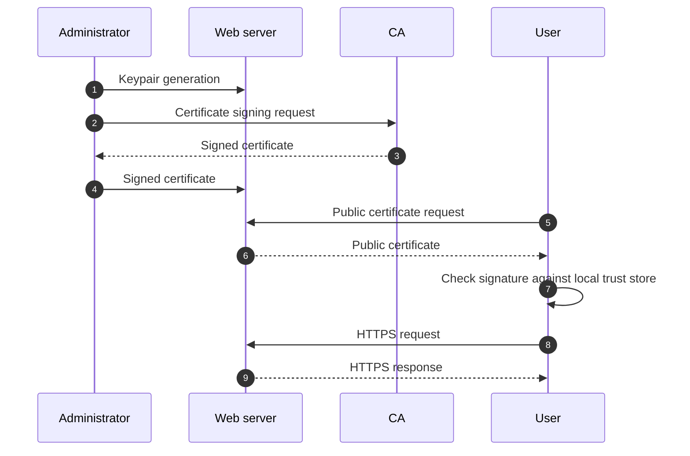

# Security

## Table of contents

- [1. Security facts](#1-security-facts)
- [2. Elements of security](#2-elements-of-security)
- [3. How security is compromised](#3-how-security-is-compromised)
    - [3.1. Social engineering](#31-social-engineering)
    - [3.2. Software vulnerabilities](#32-software-vulnerabilities)
    - [3.3. DDoS attacks](#33-ddos-attacks)
    - [3.4. Insider abuse](#34-insider-abuse)
    - [3.5. Configuration errors](#35-configuration-errors)
- [4. Basic security measures](#4-basic-security-measures)
    - [4.1. Software updates](#41-software-updates)
    - [4.2. Unnecessary services](#42-unnecessary-services)
    - [4.3. Remote event logging](#43-remote-event-logging)
    - [4.4. Backups](#44-backups)
    - [4.5. Viruses and worms](#45-viruses-and-worms)
    - [4.6. Rootkits](#46-rootkits)
    - [4.7. Packet filtering](#47-packet-filtering)
    - [4.8. Passwords and multifactor authentication](#48-passwords-and-multifactor-authentication)
    - [4.9. Vigilance](#49-vigilance)
    - [4.10. Application penetration testing](#410-application-penetration-testing)
- [5. Cryptography primer](#5-cryptography-primer)
    - [5.1. Symmetric key cryptography](#51-symmetric-key-cryptography)
    - [5.2. Public key cryptography](#52-public-key-cryptography)
    - [5.3. Public key infrastructure](#53-public-key-infrastructure)
- [Glossary](#glossary)
- [Bibliography](#bibliography)
- [Licenses](#licenses)

## 1. Security facts

Computer security is in a sorry state. In contrast to the progress seen in virtually every other area of computing, security flaws have become increasingly dire and the consequences of inadequate security more severe.

Part of the challenge is that security problems are not purely technical. Unfortunately, these problems cannot be solved just by buying a particular product or service from a third party.

As a system administrator you bear a heavy burden. You must push an agenda that secures your organization's systems and networks, ensures that they are vigilantly monitored, and properly educates your users and staff, familiarize yourself with current security technology, and work with experts to identify and resolve vulnerabilities at your site.

> [!note]
> As a rule of thumb, the more security you introduce, the more constrained you and your users will be. In other words, as security increases, convenience decreases, and vice versa.

## 2. Elements of security

The field of information security is quite broad, but it is often described by the confidentiality, integrity, and availability (CIA) triad

| Principle           | Goal                                                                                                                                                                                         |
| ------------------- | -------------------------------------------------------------------------------------------------------------------------------------------------------------------------------------------- |
| Confidentiality (C) | Access to information should be limited to those who are authorized to have it (privacy of data)                                                                                             |
| Integrity (I)       | Information is valid and has not been altered in unauthorized ways (authenticity and trustworthiness of information)                                                                         |
| Availability (A)    | Information must be accessible to authorized users when they need it; otherwise, the data has no value. Outages not caused by intruders also fall into the category of availability problems |

## 3. How security is compromised

### 3.1. Social engineering

Social engineering is the use of psychological influence to persuade people to take actions or reveal information
- Social engineering exploits human factors rather than software vulnerabilities
- The goal is information gathering, fraud, or system access

> [!warning]
> Human users (and administrators) of a computer system are the weakest links in the chain of security. No amount of technology can protect against the user element.

> [!tip]
> A good security policy should include training for employees; communications to inform about security threats and best practices; social engineering attacks of your own (explicit permission required).

---

[Phishing](https://attack.mitre.org/techniques/T1566/) is a form of social engineering where attackers deceive people into executing malicious code or revealing sensitive information (aka [phishing for information](https://attack.mitre.org/techniques/T1598/)).

Phishing begins with deceptive communication, typically an email containing malicious attachments or links ([email spoofing](https://attack.mitre.org/techniques/T1672/) and thread hijacking) or a message on a social media platform. The goal is usually to execute malicious code on victim systems.

Targeted attacks (spearphishing) can be especially hard to defend against because the communication often includes victim-specific information that lends an appearance of authenticity.

### 3.2. Software vulnerabilities

A vulnerability is a flaw or weakness in a system's design, implementation, or management that can be exploited by an attacker to compromise its security.

Buffer overflows are an example of a software bug with complex security implications. Developers often allocate buffers, which are predetermined amounts of temporary memory space.

If the code is not careful about checking the size of the data against the size of the buffer, the memory adjacent to the allocated space is at risk of being overwritten. Hackers can input carefully composed data that crashes the program or, in the worst case, executes arbitrary code.

---

Buffer overflows are a subcategory of a larger class of software bugs known as input validation vulnerabilities. If the code processes input without rigorously checking it for appropriate format and content, bad things can happen.

In general, publicly available code is thought to lead to better security.

> [!note]
> As a rule of thumb, the more people who can scrutinize the code, the greater the chance that someone will spot a security weakness.

### 3.3. DDoS attacks

A distributed denial-of-service (DDoS) attack aims to make a system unavailable to its intended users by temporarily or indefinitely disrupting the victim's availability.

[Network (D)DoS attacks](https://attack.mitre.org/techniques/T1498/) flood the target with network traffic, thereby exhausting the target's network bandwidth. For example, an attacker can send 100 Gbps of traffic to a server that is hosted by a network with 1 Gbps connection to the Internet.

[Endpoint (D)DoS attacks](https://attack.mitre.org/techniques/T1499/) exhaust the system resources the target's services are hosted on or exploit the system to cause a persistent crash condition. In contrast to a network (D)DoS attack, this attack denies availability without saturating the network.

---

To conduct a DDoS attack, attackers typically plant malicious code on unprotected devices outside the victim's network. This code lets the attackers remotely [command and control](https://attack.mitre.org/tactics/TA0011/) these intermediary systems, which form a so-called "botnet".

In the most common DDoS scenario, the minions of the botnet are instructed to pelt the victim with network traffic.

> [!warning]
> In recent years, botnets have been assembled from Internet-connected devices such as IP cameras, printers, and even baby monitors. These devices have essentially no security, and the owners usually remain unaware that their devices have been compromised.

### 3.4. Insider abuse

Employees, contractors, and consultants are trusted agents of an organization and are granted special privileges. Sometimes these privileges are abused. Insiders can steal or reveal data, disrupt systems for financial gain, or create havoc for political reasons.

> [!warning]
> This type of attack is often the hardest of all to detect. As most security measures guard against external threats, such measures are not effective against users who have been granted access.

> [!warning]
> System administrators must never knowingly install back doors in the environment for their own use. Such facilities are too easily misinterpreted or exploited by others.

### 3.5. Configuration errors

Systems can be configured securely or not-so-securely. Software is developed to be useful instead of annoying, hence not-so-securely is too often the default.

An example of a host configuration vulnerability is the standard practice of allowing Linux systems to boot without requiring a [boot loader](https://github.com/fglmtt/admin/blob/main/lectures/booting-and-system-management-daemons.md#12-boot-loader) password. The GRand Unified Bootloader (GRUB) can be configured at installation to require a password, but administrators almost never activate this option. This omission leaves the system open to physical attack.

However, this is also a perfect example of the need to balance security against usability (see [§1](#1-security-facts)). If the system were unintentionally rebooted (e.g., after a power outage), an administrator would have to be physically there to get the computer running again.

## 4. Basic security measures

Most systems do not come secured out of the box. Customizations made during and after installation change the security profile of new systems.

Administrators should take steps to
- Harden new systems
- Integrate them into the local environment
- Plan for their long-term security maintenance

> [!tip]
> When auditors come knocking, it is useful to be able to prove that you have followed some kind of standard procedure, especially if that procedure conforms to external recommendations and best practices for your industry.

---

At the highest level, you can improve your site's security by keeping in mind a few rules of thumb
1. Apply the principle of least privilege. This rule applies to any situation where [access control](https://github.com/fglmtt/admin/blob/main/lectures/access-control-and-rootly-powers.md) is used
2. Layer security measures to achieve defense in depth. For example, don't rely only on your external firewall for network protection
3. Minimize the attack surface. The fewer the interfaces, exposed systems, unnecessary services, and unused systems, the lower the potential for security issues

> [!tip]
> Automation is a close ally. The more security steps you automate, the less room is available for human error.

### 4.1. Software updates

Keeping systems updated with the latest patches is an administrator's highest-value security chore. While patches may introduce novel security problems, most exploits target older vulnerabilities. You are much better off with regularly updated systems

| What to do                                                                                                         | Suggestion                                                                                                                                |
| ------------------------------------------------------------------------------------------------------------------ | ----------------------------------------------------------------------------------------------------------------------------------------- |
| Regular schedule for routine patches                                                                               | Design the schedule with users in mind. Monthly updates are usually sufficient, but be prepared to apply critical patches on short notice |
| Change plan that documents the impact of patches, post-installation testing steps, and how to back out the changes | Communicate the plan to all relevant parties                                                                                              |
| Understanding of which patches pertain to the environment                                                          | Subscribe to vendor-specific security mailing lists and blogs                                                                             |
| Inventory of applications and operating systems used in your environment                                           | Automate infrastructure management and use reporting software                                                                             |

### 4.2. Unnecessary services

Disable, and possibly remove, unnecessary services, especially if they are network daemons. If a service is unneeded, stop it and make sure it [won't be restarted at boot time](https://github.com/fglmtt/admin/blob/main/lectures/booting-and-system-management-daemons.md#22-controlling-systemd).

To inspect what is going on a local system, you can [sniff packets](https://github.com/fglmtt/admin/blob/main/lectures/networking.md#23-sniffing-packets) and/or [check the existing sockets](https://github.com/fglmtt/admin/blob/main/lectures/networking.md#24-testing-port-reachability). Once you have the PID, you can [get more information about the process](https://github.com/fglmtt/admin/blob/main/lectures/process-control.md#3-process-monitoring). To inspect a remote system, you can use a network port scanner—a tool designed to identify which network ports are open, closed, or filtered. Since most network services are associated with well-known port numbers, this information tells you quite a lot about the software a machine is running.

> [!warning]
> Do not run a network port scanner on someone else's network without permission from one of that network's administrators.

### 4.3. Remote event logging

The syslog service forwards [log](https://github.com/fglmtt/admin/blob/main/lectures/logging.md) information to files, lists of users, or other hosts on your network. Consider setting up a secure host to act as a central logging machine that parses forwarded logs and raises alerts if necessary.

> [!tip]
> Remote logging also prevents hackers from covering their tracks by tampering with log files on systems that have been compromised.

> [!note]
> Although syslog is the default choice on most systems, you need to customize the configuration to set up remote logging.

### 4.4. Backups

A backup is a copy of computer data taken and stored elsewhere so that it may be used to restore the original after a data loss event. Regular, tested system backups are an essential part of any site security plan. Backups fall into the "availability" bucket of the CIA triad.

Make sure that
- All filesystems are replicated
- Some backups are stored off-site

However, backups can also be a security hazard. Protect backups by limiting (and monitoring) access and by encrypting backup files.

### 4.5. Viruses and worms

A virus is a type of malware that, when executed, replicates itself by modifying computer programs and inserting its own code into those programs. A worm is standalone malware that replicates itself to spread to other computers. Worms do not require host programs.

Linux systems have historically been largely immune to viruses and worms. Some point to their smaller market share compared to Windows, while others credit their stronger access control.

The latter argument holds some merit: Without [`root`](https://github.com/fglmtt/admin/blob/main/lectures/access-control-and-rootly-powers.md#123-the-root-account) privileges, malware has limited reach. Counterintuitively, one valid reason to run antivirus software on Linux is to protect connected Windows systems from Windows-specific malware. Of course, doing so introduces an additional attack surface—the antivirus software itself.

### 4.6. Rootkits

A rootkit is software, typically malicious, designed to enable access to a computer or an area of its software that is not otherwise allowed and often masks its existence or the existence of other software.

Rootkits come in many flavors and vary in sophistication, from simple application replacements, such as hacked versions of `ls` and `ps`, to kernel modules that are nearly impossible to detect.

Although there are tools to help administrators remove rootkits from compromised systems, the time it takes to perform a thorough cleaning would probably be better spent saving data and wiping the system. The most advanced rootkits are aware of common removal programs and make attempts to subvert them.

### 4.7. Packet filtering

If you are connecting a system to a network that has Internet access, you **must** install a [packet-filtering router or firewall](https://github.com/fglmtt/admin/blob/main/lectures/networking.md#1-firewalls) between the system and the outside world. The packet filter should pass only traffic for services that you specifically want to offer from that system.

Limiting the public exposure of your systems is a first-line defense. Many systems do not need to be directly accessible to the Internet.

In addition to firewalling systems at the Internet gateway, you can double up with host-based packet filters, such as `iptables` or `ufw` on Linux. Determine which services run on the host, open ports only for those services, and, potentially, limit which source addresses are allowed to connect to each port.

### 4.8. Passwords and multifactor authentication

Every [account](https://github.com/fglmtt/admin/blob/main/lectures/user-management.md#1-users) must have a password and it needs to be something that cannot be easily guessed. Password complexity rules may be a hassle, but they exist for a reason.

> [!warning]
> Guessable passwords are one of the leading sources of compromise.

> [!tip]
> Multifactor authentication (MFA) systems are a good choice. These systems validate your identity both through something you know (a password or passphrase) and something you have (a physical device, fingerprint, etc.). Almost any interface can be protected with MFA, from shell accounts to bank accounts. MFA is now an absolute minimum requirement (at least) for any Internet-facing portal that gives access to administrative privileges.

---

In the world of [`sudo`](https://github.com/fglmtt/admin/blob/main/lectures/access-control-and-rootly-powers.md#23-executing-commands-as-another-user), administrators' personal passwords are just as important as `root` passwords.

> [!warning]
> It is all too common that a large breach occurs and usernames with passwords are exposed. If those usernames and passwords were used elsewhere, all those accounts are compromised.

> [!tip]
> Never use the same password for more than one purpose.

---

One way to thwart poor password choices is to try to break the passwords yourself and to [force users to change passwords](https://github.com/fglmtt/admin/blob/main/lectures/user-management.md#33-setting-up-initial-passwords) that you have broken.

> [!tip]
> Although most systems use a [shadow password file](https://github.com/fglmtt/admin/blob/main/lectures/access-control-and-rootly-powers.md#124-set-uid-execution) to hide encrypted passwords, it is still wise to verify that your users' passwords are crack resistant (especially for those with `sudo` privileges) using an offline cracker like [John the Ripper](https://www.openwall.com/john/).

> [!warning]
> Offline cracking is bounded only by the attacker's hardware, which is why hash leaks are catastrophic.

---

```shell
$ sudo unshadow /etc/passwd /etc/shadow > mypasswd
$ john --format=crypt mypasswd

[...]

$ john --show mypasswd
root:root:0:0:root:/root:/bin/bash
ubuntu:mattia:1000:1000:Ubuntu:/home/ubuntu:/bin/bash

2 password hashes cracked, 0 left
```

> [!warning]
> Treat cracker output as sensitive — it is effectively a list of plaintext passwords.

---

The most secure password of a given length consists of a random sequence of letters, punctuation, and digits. However, random passwords are impractical to memorize. It is often said that passwords should never be written down, but it is more accurate to say that they should never be left accessible to the wrong people.

A password vault is a piece of software (or a combination of software and hardware) that encrypts the passwords it stores. A user can then access the passwords stored in the vault with a single master password, which becomes the only password to remember.

> [!tip]
> As password security increases exponentially with length, your best bet is to use a very long password that is unlikely to appear somewhere else but is easy to remember (i.e., a passphrase) as the master password for the vault.

### 4.9. Vigilance

To ensure the security of your system, monitor its health, network connections, process table, and overall status on a daily basis.

Security compromises tend to start with a small foothold and expand. The earlier you identify an anomaly, the better off you will be.

> [!tip]
> Many administrators find it beneficial to work with an external firm to perform a comprehensive vulnerability analysis. These projects can
> - Draw attention to issues that you had not previously considered
> - Establish a baseline understanding of the areas in which you are most exposed

### 4.10. Application penetration testing

Applications that are exposed to the Internet need their own security precautions. It is a good idea to have all applications penetration tested to verify that they have been designed with security in mind and have the appropriate controls in place.

Penetration testing is a poorly defined discipline. The [Open Web Application Security Project (OWASP)](https://owasp.org/) tracks application vulnerabilities and methods for testing applications. If you have a professional third party perform penetration testing, make sure they adhere to the OWASP methodology.

> [!warning]
> If you have a secure network and system infrastructure, but an application running on that infrastructure allows access to sensitive data without a password, you have won the battle but lost the war.

## 5. Cryptography primer

Most software is designed with security in mind, and that implies a strong dose of cryptography. Nearly all network protocols in modern use rely on cryptography for security.

Cryptography applies mathematics to the problem of securing communications. A cryptographic algorithm, aka a cipher, is the set of mathematical steps taken to secure a message.

Encryption is the process of using a cipher to convert plain text messages to unreadable ciphertext. Decryption is the reverse of that process.

---

Cryptographers have traditional names for three subjects who participate in a simple message exchange

| Principal | Symbol | Role                                                                                                               |
| --------- | ------ | ------------------------------------------------------------------------------------------------------------------ |
| Alice     | $A$    | Wish to communicate privately with Bob                                                                             |
| Bob       | $B$    | Wish to communicate privately with Alice                                                                           |
| Charles   | $C$    | Want to compromise Alice and Bob's secrets, disrupt their communication, or impersonate one of the other principals |

The following adopts this convention.

### 5.1. Symmetric key cryptography

$A$ and $B$ share a secret key ($K_{AB}$) that they use to encrypt and decrypt messages. They must find a way to exchange the shared secret privately. Once they both know the key, they can reuse it as long as they wish. $C$ can only inspect (or interfere with) messages if he also has the key.

Symmetric keys are relatively efficient in terms of CPU usage and the size of the encrypted payloads. As a result, symmetric cryptography is often used in applications where efficient encryption and decryption are necessary.

The Advanced Encryption Standard (AES) is perhaps the most widely used symmetric key algorithm.

---

| Symbol       | Meaning                               |
| ------------ | ------------------------------------- |
| $M$          | Original message in plain text        |
| $K_{AB}$     | Shared secret key between $A$ and $B$ |
| $M_{K_{AB}}$ | Ciphertext (encrypted message)        |
| $E$          | Encryption function                   |
| $D$          | Decryption function                   |

| Who sends to whom | Encryption                  | Decryption                  |
| ----------------- | --------------------------- | --------------------------- |
| $A \rightarrow B$ | $E(K_{AB}, M) = M_{K_{AB}}$ | $D(K_{AB}, M_{K_{AB}}) = M$ |
| $B \rightarrow A$ | $E(K_{AB}, M) = M_{K_{AB}}$ | $D(K_{AB}, M_{K_{AB}}) = M$ |

### 5.2. Public key cryptography

> [!note]
> A limitation of symmetric keys is the need to securely exchange the secret key in advance. The only way to do so with complete security is to meet in person without interference, a major inconvenience.

The invention of public key cryptography, which addresses this problem, was an extraordinary breakthrough when it occurred in the 1970s. $A$ generates a pair of keys. The private key ($K_{A}^{-1}$) remains a secret, while the public key ($K_{A}$) can be widely known. $B$ does the same. When $A$ wants to send a message ($M$) to $B$, she encrypts it with $K_B$. $B$ who holds $K_{B}^{-1}$ is the only one that can decrypt $M$.

The Rivest-Shamir-Adleman (RSA) cryptosystem is perhaps the most widely used public key cryptosystem.

---

| Symbol         | Meaning                        |
| -------------- | ------------------------------ |
| $M$            | Original message in plain text |
| $K^{-1}_{A/B}$ | $A/B$'s secret key             |
| $K_{A/B}$      | $A/B$'s public key             |
| $M_{K_{A/B}}$  | Ciphertext (encrypted message) |
| $E$            | Encryption function            |
| $D$            | Decryption function            |

| Who sends to whom | Encryption                | Decryption                     |
| ----------------- | ------------------------- | ------------------------------ |
| $A \rightarrow B$ | $E(K_{B}, M) = M_{K_{B}}$ | $D(K_{B}^{-1}, M_{K_{B}}) = M$ |
| $B \rightarrow A$ | $E(K_{A}, M) = M_{K_{A}}$ | $D(K_{A}^{-1}, M_{K_{A}}) = M$ |

---

$A$ can also sign ($S$) the message with her private key ($K_{A}^{-1}$)

$$E(K_{A}^{-1}, M) = S_{K_{A}^{-1}}$$

$B$ can then use $A$'s public key ($K_{A}$) to validate the authenticity of the message

$$D(K_{A}, S_{K_{A}^{-1}}) = M$$

This process is known as digital signature.

---

> [!note]
> Public key ciphers rely on the mathematical concept of trapdoor functions, in which a value is easy to compute, and yet it is difficult to derive the steps that produced that value. The performance characteristics of asymmetric ciphers generally render them impractical for encrypting large quantities of data.

Asymmetric ciphers are often paired with symmetric ones to realize the benefits of both
- Public keys to establish a session and share a symmetric key
- Symmetric key to encrypt the ongoing conversation

In digital signatures, asymmetric ciphers are only used to encrypt a hash of the message rather than the message itself.

### 5.3. Public key infrastructure

If $A$ wants to send $B$ a private message, $A$ must trust that the public key she has for $B$ is in fact his and not $C$'s. Validating the authenticity of public keys at Internet scale is a formidable challenge.

The public key infrastructure used to implement Transport Layer Security (TLS) on the web addresses this problem by trusting a third party known as a certificate authority (CA). $A$ and $B$ may not know each other, but they both trust the CA and know $K_{CA}$. The CA signs certificates for $K_A$ and $K_B$ with $K^{-1}_{CA}$.

> [!warning]
> The CA is implicitly trusted in this system. Modern OSes trust hundreds of CAs by default. The CAs themselves are therefore high-value targets for hackers. When a CA is hacked, the entire system of trust is broken.

---



## Glossary

| Term                                          | Meaning                                                                                                                                                                                                                                                                                                         |
| --------------------------------------------- | --------------------------------------------------------------------------------------------------------------------------------------------------------------------------------------------------------------------------------------------------------------------------------------------------------------- |
| Advanced Encryption Standard (AES)            | A symmetric-key cryptographic algorithm                                                                                                                                                                                                                                                                         |
| Availability                                  | Information must be accessible to authorized users when they need it                                                                                                                                                                                                                                            |
| Backup                                        | A copy of computer data taken and stored elsewhere so that it may be used to restore the original after a data loss event                                                                                                                                                                                       |
| Botnet                                        | A network of infected devices controlled remotely without the owner's knowledge                                                                                                                                                                                                                                 |
| Buffer                                        | A predetermined amount of temporary memory space to store a particular piece of information                                                                                                                                                                                                                     |
| Buffer overflow                               | A vulnerability that occurs when a program writes more data to a memory buffer than it can hold, causing data to overflow into adjacent memory and potentially allowing attackers to execute arbitrary code                                                                                                     |
| Certificate authority (CA)                    | An entity that stores, signs, and issues digital certificates                                                                                                                                                                                                                                                   |
| Ciphertext                                    | A message that has been encrypted                                                                                                                                                                                                                                                                               |
| Confidentiality                               | Access to information should be limited to those who are authorized to have it                                                                                                                                                                                                                                  |
| Cryptographic algorithm (or cipher)           | The set of mathematical steps taken to secure a message                                                                                                                                                                                                                                                         |
| Decryption                                    | The reverse of encryption                                                                                                                                                                                                                                                                                       |
| Digital certificate                           | An electronic document used to prove the validity of a public key. A digital certificate includes the public key and information about it, information about the identity of its owner (called the subject), and the digital signature of a CA that has verified the certificate's contents (called the issuer) |
| Digital signature                             | A ciphertext created using a private key to verify the authenticity and integrity of a message                                                                                                                                                                                                                  |
| Email spoofing                                | An attack where the attacker forges the sender's address in order to establish contact with the victim under false pretenses                                                                                                                                                                                    |
| Encryption                                    | The process of using a cipher to convert plain text messages to unreadable ciphertext                                                                                                                                                                                                                           |
| Endpoint (D)DoS                               | An attack where attackers exhaust the system resources the target's services are hosted on or exploit the system to cause a persistent crash condition                                                                                                                                                          |
| Exploit                                       | A piece of code or technique that takes advantage of a software or system vulnerability for malicious purposes                                                                                                                                                                                                  |
| Hash (aka digest, checksum, or fingerprint)   | The output value of a hash function                                                                                                                                                                                                                                                                             |
| Hash function                                 | A function that accepts input data of any length and generates a fixed-length value that is somehow derived from that data                                                                                                                                                                                      |
| Input validation vulnerability                | A software vulnerability that occurs when a system fails to properly check or sanitize user input, allowing attackers to inject malicious data that can lead to security issues                                                                                                                                 |
| Integrity                                     | Information is valid and has not been altered in unauthorized ways                                                                                                                                                                                                                                              |
| Malware                                       | Software intentionally designed to damage, disrupt, steal, or gain unauthorized access to computers, networks, or data                                                                                                                                                                                          |
| Multifactor authentication (MFA)              | A scheme that validates your identity both through something you know (a password or passphrase) and something you have (a physical device)                                                                                                                                                                     |
| Network (D)DoS                                | An attack where attackers flood the victim with network traffic, thereby exhausting the victim's network bandwidth                                                                                                                                                                                              |
| Network port scanner                          | Software that probes a target system to identify which network ports are open, closed, or filtered                                                                                                                                                                                                              |
| Open Web Application Security Project (OWASP) | An online community that produces freely available articles, methodologies, documentation, tools, and technologies in the fields of IoT, system software and web application security                                                                                                                           |
| Passphrase                                    | A passphrase is a longer, more memorable alternative to a password, often used to control access to and the operation of a cryptographic program                                                                                                                                                                |
| Password                                      | Secret data, typically a string of characters, usually used to confirm a user's identity                                                                                                                                                                                                                        |
| Password vault (or password manager)          | A software program to prevent password fatigue by automatically generating, autofilling and storing passwords                                                                                                                                                                                                   |
| Patch                                         | Data intended to be used to modify an existing software, often to fix bugs and security vulnerabilities                                                                                                                                                                                                         |
| Penetration testing                           | The act of breaking into a computer network with the owner's permission for the purpose of discovering security weaknesses                                                                                                                                                                                      |
| Phishing                                      | A form of social engineering where attackers deceive people into executing malicious code or revealing sensitive information                                                                                                                                                                                    |
| Private key                                   | A secret cryptographic key used to decrypt data encrypted with the corresponding public key or to create digital signatures that prove the sender's identity                                                                                                                                                    |
| Public key                                    | A cryptographic key that can be shared openly and is used to encrypt data or verify digital signatures                                                                                                                                                                                                          |
| Public key cryptography                       | A form of cryptography uses a pair of cryptographic keys—one public and one private—where the public key encrypts data and only the corresponding private key can decrypt it                                                                                                                                    |
| Rivest-Shamir-Adleman (RSA) cryptosystem      | A public key cryptosystem. The initialism "RSA" comes from the surnames of Ron Rivest, Adi Shamir and Leonard Adleman, who publicly described the algorithm in 1977                                                                                                                                             |
| Rootkit                                       | Software, typically malicious, designed to enable access to a computer or an area of its software that is not otherwise allowed and often masks its existence or the existence of other software                                                                                                                |
| Social engineering                            | The use of psychological influence to persuade people to take actions or reveal confidential information                                                                                                                                                                                                        |
| Spearphishing                                 | A form of phishing where the target is a specific individual, company, or industry                                                                                                                                                                                                                              |
| Symmetric key cryptography                    | A form of cryptography that uses the same cryptographic keys for both the encryption of plaintext and the decryption of ciphertext                                                                                                                                                                              |
| Thread hijacking                              | An attack where the attacker makes the victim join an existing communication thread that includes malicious files or links                                                                                                                                                                                      |
| Transport Layer Security (TLS)                | A cryptographic protocol that ensures secure communication over a network by encrypting data and authenticating the parties involved                                                                                                                                                                            |
| Virus                                         | A type of malware that, when executed, replicates itself by modifying other computer programs and inserting its own code into those programs                                                                                                                                                                    |
| Vulnerability                                 | A flaw or weakness in a system's design, implementation, or management that can be exploited by an attacker to compromise its security                                                                                                                                                                          |
| Worm                                          | A standalone malware that replicates itself in order to spread to other computers                                                                                                                                                                                                                               |

## Bibliography

| Author            | Title                                                                   | Year |
| ----------------- | ----------------------------------------------------------------------- | ---- |
| Nemeth, E. et al. | [UNIX and Linux System Administration Handbook](https://www.admin.com/) | 2018 |
| Community         | [Wikipedia](https://en.wikipedia.org/)                                  | 2025 |
| MITRE             | [ATT&CK](https://attack.mitre.org/)                                     | 2025 |

## Licenses

| Content | License                                                                                                                       |
| ------- | ----------------------------------------------------------------------------------------------------------------------------- |
| Code    | [MIT License](https://mit-license.org/)                                                                                       |
| Text    | [Creative Commons Attribution-NonCommercial-ShareAlike 4.0 International](https://creativecommons.org/licenses/by-nc-sa/4.0/) |
